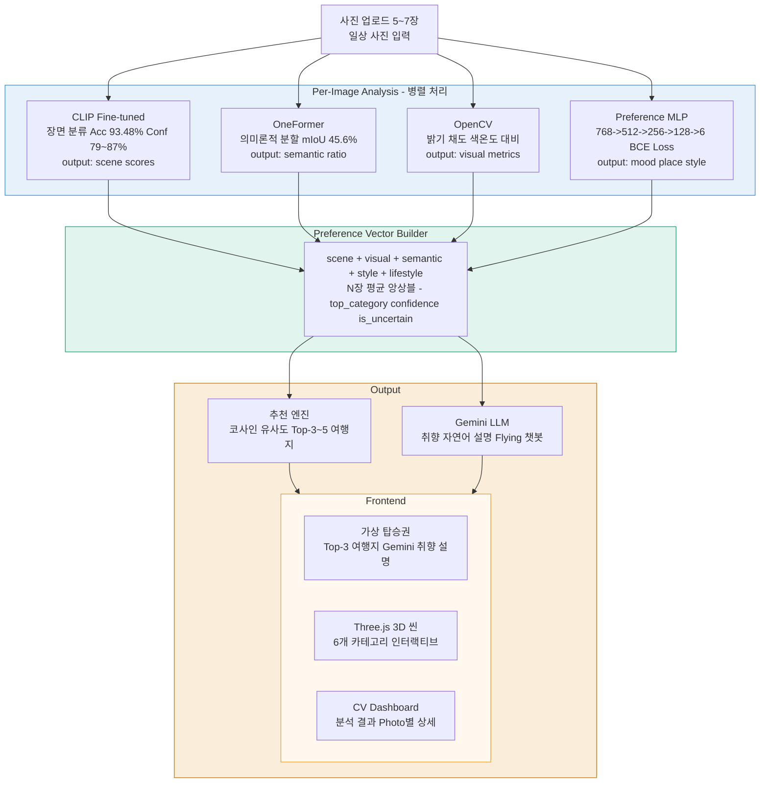
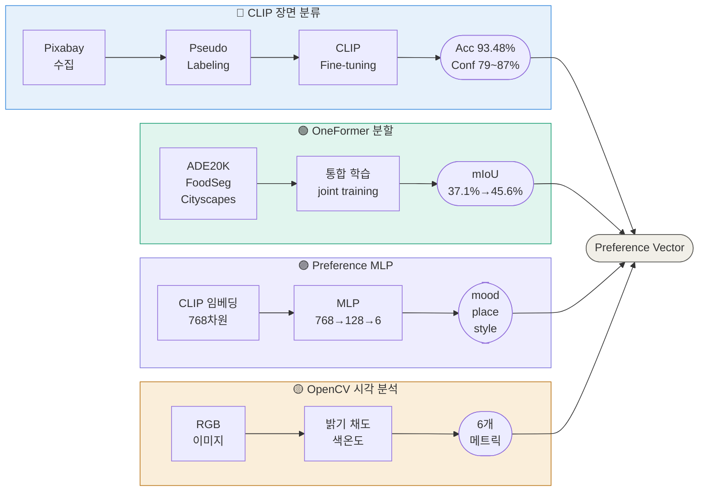
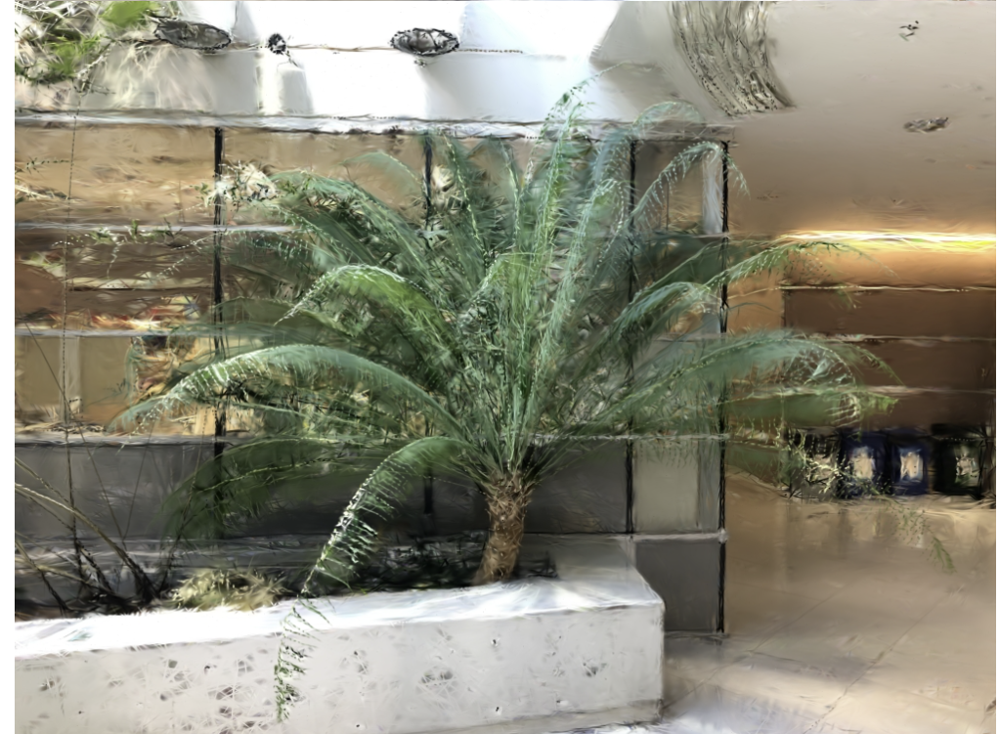
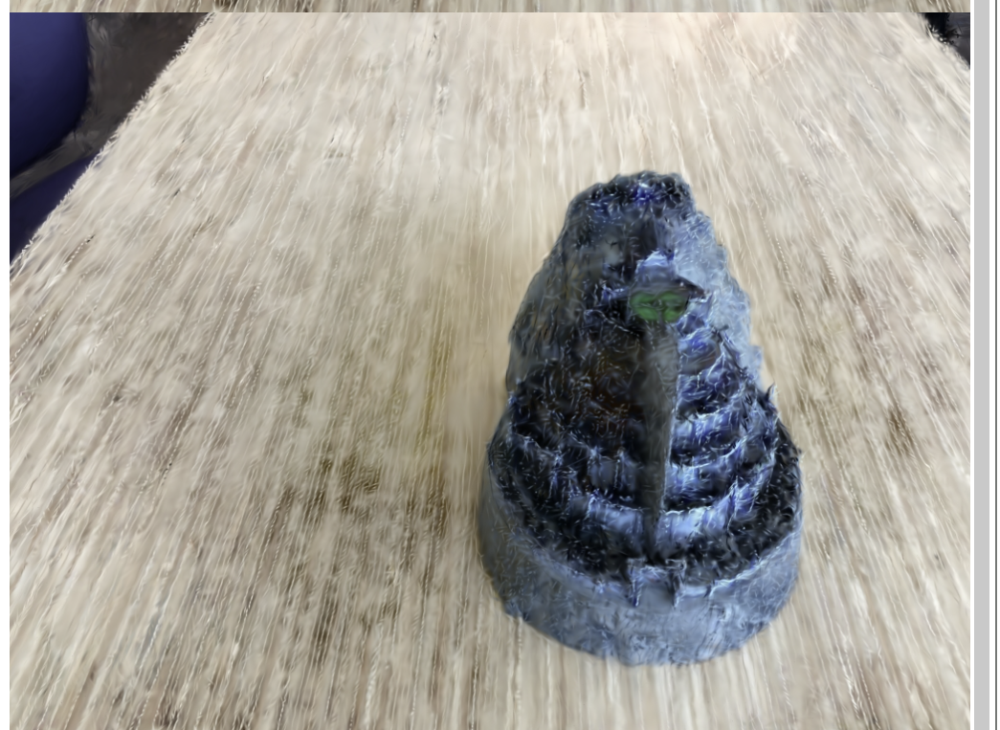

# 📸 PhotoTrip
## From Everyday Photos to Travel Preferences
### 내 갤러리 속 잠재적 시각 선호를 분석하여 여행 취향을 추론하는 멀티모달 AI 시스템

> CLIP · OneFormer · OpenCV · Preference MLP를 통합하여 사용자의 잠재적 시각 취향을 분석하고,  
> Preference Vector 기반 맞춤 여행지를 추천하는 End-to-End AI 서비스

---

## 📋 Table of Contents
- [Demo](#-demo)
- [Why PhotoTrip?](#-why-is-phototrip-different)
- [Why A Single Model Is Not Enough?](#-why-a-single-model-is-not-enough)
- [Preference Vector](#-preference-vector)
- [System Architecture](#️-system-architecture)
- [Tech Stack](#️-tech-stack)
- [Key Contributions](#-key-contributions)
- [Related Work](#-related-work)
- [Model Architecture](#-model-architecture)
- [Experiments & Results](#-experiments--results)
- [3D Reconstruction Experiment](#-3d-reconstruction-experiment)
- [Limitations & Future Work](#-limitations--future-work)
- [Installation & Usage](#-installation--usage)
- [Conclusion](#-conclusion)
- [References](#references)

---

## 🎥 Demo

<p align="center">
  
</p>

| Category | Demo |
|----------|------|
| 🌊 Beach | [Video](https://github.com/user-attachments/assets/a79cddb6-0e5d-4cad-ab43-86cdc3fb5185) |
| 🌿 Nature | [Video](https://github.com/user-attachments/assets/45d3d391-dde3-41f9-a6ee-d80ff77b4c9f) |
| 🏙️ City | Coming Soon |
| 🏛️ Culture | [Video](https://github.com/user-attachments/assets/aa2ad316-7270-4293-bfdf-e43aabe4dada) |
| 🍕 Food | [Video](https://github.com/user-attachments/assets/5ef5fe29-4734-4f77-87b2-511de3855b48) |
| 🎆 Festival | [Video](https://github.com/user-attachments/assets/96f4ace8-f7e2-4662-9a4c-6044df3dc3ec) |

---

## 🏆 Key Results

| 모듈 | 결과 |
|------|------|
| CLIP Fine-tuning | **93.48% Accuracy** |
| CLIP Confidence | **79~87%** |
| OneFormer Fine-tuning | **45.6 mIoU** (+8.5%p) |
| Preference MLP | **Macro F1 0.9450** |
| Recommendation Engine | Top-3 Personalized Destination |
| Frontend Visualization | Three.js Interactive Scene |
| End-to-End Pipeline | Upload → Analysis → Recommendation → Visualization |

<p align="center">

</p>

<p align="center">


</p>

---

## 💡 Why Is PhotoTrip Different?

기존 여행 추천 시스템은

- 설문조사
- 클릭 로그
- 예약 이력

등의 **명시적 행동 데이터**에 의존한다.

반면 PhotoTrip은

사용자가 무의식적으로 촬영한 일상 사진 속에서

- 장소 선호
- 공간 구성 선호
- 색감 선호
- 분위기 선호

를 추론한다.

---

핵심은 새로운 모델이 아니다.

핵심은

**"사용자의 시각적 취향을 어떻게 표현할 것인가?"**

이다.

---

## 🔍 Why A Single Model Is Not Enough?

여행 취향은 단일 컴퓨터 비전 모델로 표현할 수 없다.

예를 들어 CLIP은 beach인지 city인지는 높은 정확도로 분류할 수 있다.

그러나

- 바다가 사진에서 차지하는 **비율**
- **따뜻한 색감** 여부
- **활기찬 분위기** 여부
- **공간 구성** 특성

은 알 수 없다.

반대로 OneFormer는 `water 43% / vegetation 21%` 와 같은 공간 정보를 제공할 수 있지만  
사용자의 **감성적 선호**는 표현하지 못한다.

OpenCV는 색감을 정량화할 수 있지만 **장소 의미**를 이해하지 못한다.

Preference MLP는 분위기를 추정할 수 있지만 **공간 구조**는 파악하지 못한다.

| Module | 제공하는 정보 | 제공하지 못하는 정보 |
|--------|------------|------------------|
| CLIP | 장면 카테고리 (beach / city / ...) | 색감, 분위기, 공간 비율 |
| OneFormer | 픽셀 단위 의미 구성 비율 | 감성적 선호, 분위기 |
| OpenCV | 밝기 / 채도 / 색온도 | 장소 의미, 맥락 |
| Preference MLP | 분위기 / 라이프스타일 벡터 | 공간 구조, 장소 범주 |

PhotoTrip은 **Scene + Semantic + Visual + Style** 네 가지 정보를 통합하여  
단일 모델이 표현할 수 없는 여행 취향을 분석한다.

| Module | 추출 정보 | 성능 | 단독 사용 시 한계 |
|--------|----------|------|----------------|
| CLIP | Scene Category | 93.48% Accuracy | 발리 ≠ 제주 구분 불가 |
| OneFormer | Semantic Composition | 45.6 mIoU | 감성적 선호 표현 불가 |
| OpenCV | Brightness / Saturation / Color Temperature | 6 Visual Metrics | 장소 의미 이해 불가 |
| Preference MLP | Mood / Lifestyle | Macro F1 0.9450 | 공간 구조 파악 불가 |

---

## 🧠 Preference Vector

PhotoTrip의 핵심 기여는

CLIP · OneFormer · OpenCV · Preference MLP의 출력을

하나의 **Preference Vector**로 통합하는 것이다.

기존 연구가 장면 분류 결과를 제공하는 데 집중했다면,  
PhotoTrip은 **사용자의 취향을 벡터 공간에 표현**한다.

### Example

**입력 사진** — 카페 · 바다 · 노을 · 음식

↓ 멀티모달 분석

**Preference Vector**

```json
{
  "beach": 0.82,
  "nature": 0.11,
  "water": 0.43,
  "vegetation": 0.21,
  "warm_tone": 0.79,
  "saturation": 0.74,
  "vibrant": 0.68,
  "cozy": 0.14
}
```

↓ 코사인 유사도 기반 매칭

**추천 결과**

1. 🌴 Bali
2. 🏖️ Phuket
3. 🌊 Cebu

↓ Gemini 자연어 설명

> "따뜻한 색감과 활기찬 분위기를 선호하는 경향이 강합니다.  
> 바다와 음식이 어우러지는 리조트형 여행지가 잘 맞을 것 같습니다."

---

## 🏗️ System Architecture



### 카테고리별 분석 예시

| 입력 사진 특성 | 분류 결과 | 추천 여행지 예시 |
|--------------|---------|----------------|
| 해변, 바다, 모래 | 🏖️ beach | 발리, 몰디브, 제주 |
| 산, 숲, 자연 | 🌲 nature | 퀸스타운, 파타고니아, 설악산 |
| 도시, 야경, 빌딩 | 🌆 city | 도쿄, 홍콩, 파리 |
| 사원, 박물관, 문화유산 | 🏛️ culture | 교토, 로마, 이스탄불 |
| 공연, 축제, 음악 | 🎪 festival | 밀라노, 에든버러, 라스베가스 |
| 음식, 카페, 길거리 음식 | 🍜 food | 나폴리, 방콕, 오사카 |

---

## 🛠️ Tech Stack

| 계층 | 기술 |
|------|------|
| Backend | FastAPI · PyTorch · HuggingFace Transformers |
| 장면 분류 | CLIP ViT-B/32 fine-tuned |
| 의미론적 분할 | OneFormer (swin_large) |
| 시각 분석 | OpenCV |
| 분위기·취향 분류 | Preference MLP · BCE Loss · Pseudo Labeling |
| LLM | Google Gemini API |
| Frontend | Three.js · HTML/CSS/JS |
| 학습 환경 | Google Colab · Kaggle (GPU) |

---

## 💡 Key Contributions

1. **멀티모달 Preference Vector 설계 및 앙상블**

   CLIP · OneFormer · OpenCV · Preference MLP 4개 이질적 모듈의 출력을  
   단일 Preference Vector로 통합하는 구조를 직접 설계.  
   scene(6차원) · visual(6차원) · semantic(5차원) · style · lifestyle을  
   하나의 벡터로 표현하며, 5~7장 입력 시 per-image 벡터를  
   평균 앙상블하여 노이즈에 robust한 취향 표현을 구축.

   OpenCV 색감 분석(밝기·채도·색온도·대비)과 Preference MLP 출력을  
   여행지 프로필과 코사인 유사도로 매칭함으로써,  
   CV 분석 결과가 직접 추천에 반영되는 end-to-end 파이프라인 완성.  
   *(예: 따뜻한 색감 + vibrant 스타일 → 발리·방콕 추천)*

2. **Accuracy–Confidence 트레이드오프 실험 설계**

   SigLIP과 CLIP을 동일 데이터셋에서 fine-tuning 후  
   val accuracy와 inference confidence를 직접 비교.  
   SigLIP은 accuracy 93.56%에도 confidence가 33~37%에 머물러  
   Preference Vector 품질을 저하시킴을 확인.  
   CLIP fine-tuned는 93.48% accuracy + 79~87% confidence로 최종 채택.  
   총 5가지 실험 변형(Pseudo Labeling, large 데이터, festival 추가 등)을 직접 설계·수행.

3. **OneFormer 멀티데이터셋 학습 파이프라인 설계**

   ADE20K · FoodSeg103 · Cityscapes를 단일 모델로 통합 학습하기 위해  
   Mask2Former 대신 OneFormer를 직접 선택·적용.  
   Travel-class mIoU 37.1% → 45.6% (+8.5%p) 달성.

4. **Pseudo Labeling 데이터 파이프라인 구축**

   Pixabay API 수집 → SigLIP 자동 라벨링 →  
   confidence 필터링 전 과정을 직접 설계 및 구현.

5. **Preference MLP 설계 및 실험**

   BCE Loss + class weights로 클래스 불균형을 처리하고,  
   mood · place · style 3개 Preference MLP를 독립적으로 설계.  
   CLIP 임베딩(768차원) → 6-class multilabel 분류.  
   Place Preference MLP Macro F1 **0.9450** 달성.

6. **COLMAP + 3DGS 렌더링 파이프라인 구축 실험**

   Structure-from-Motion(COLMAP) 기반 포인트 클라우드 생성부터  
   3D Gaussian Splatting 학습까지 직접 실험하여  
   2개 씬 렌더링 결과 확보.  
   웹 서비스 호환성 한계로 Three.js로 전환.

---

## 📚 Related Work

### Semantic Segmentation 발전

| 연도 | 모델 | 주요 기여 |
|------|------|----------|
| 2015 | FCN | 최초 end-to-end 픽셀 단위 분류 |
| 2017 | DeepLab v3 | Atrous convolution, multi-scale context 도입 |
| 2022 | Mask2Former | Universal segmentation 시도; 단, 태스크마다 개별 학습 필요 |
| 2023 | OneFormer | Task-conditioned joint training으로 단일 모델 멀티 태스크 가능 |

### OneFormer 채택 배경

OneFormer(Jain et al., CVPR 2023)는 task-conditioned joint training으로  
semantic · instance · panoptic segmentation을 단일 모델로 처리한다.  
task token을 입력으로 받아 하나의 모델로 여러 데이터셋을 동시에 학습할 수 있다.

| 카테고리 | 학습 데이터셋 | 도메인 |
|---------|------------|--------|
| 자연/도시/문화 | ADE20K | 실내외 범용 장면 |
| 음식 | FoodSeg103 | 음식 특화 |
| 도시/도로 | Cityscapes | 도시 주행 장면 |

Mask2Former는 태스크마다 별도 모델 학습이 필요하여  
최소 3개 모델, 3배의 GPU 메모리·학습 시간이 요구된다.  
OneFormer의 joint training으로 단일 모델 통합 학습이 가능하여 채택.

### Vision-Language Models

CLIP(Radford et al., 2021)은 4억 쌍의 이미지-텍스트 대조 학습으로  
강력한 zero-shot 전이 성능을 제공하며, softmax 기반 confidence로  
취향 신호를 명확하게 전달한다.

SigLIP(Zhai et al., 2023)은 sigmoid loss로 학습 안정성을 개선하였으나,  
inference confidence가 33~37%에 머물러 Preference Vector 품질을 저하시킨다.

---

## 🧠 Model Architecture



---

## 🔬 Experiments & Results

### 1. 장면 분류 (Scene Classification)

6-class 여행 장면 분류: beach · nature · city · culture · festival · food

| 모델 | Val Accuracy | 비고 |
|------|-------------|------|
| CLIP Zero-shot | 64.27% | 프롬프트 기반, fine-tuning 없음 |
| SigLIP 기본 | 90.91% | google/siglip-large-patch16-256 |
| SigLIP + large 데이터 | 90.52% | 데이터 규모 확대 시 소폭 하락 |
| SigLIP + festival 카테고리 | 93.56% | festival 클래스 추가 |
| SigLIP + Pseudo Labeling | 93.14% | pseudo label 기반 semi-supervised |
| **CLIP Fine-tuned** | **93.48%** | **openai/clip-vit-base-patch32 ✅** |

> **CLIP 채택 근거**: accuracy parity 조건 하에서  
> SigLIP(33~37%) 대비 CLIP(79~87%)의 월등한 inference confidence가  
> Preference Vector 품질에 직결됨.

<p align="center">
  
</p>
<p align="center">
  
  
</p>

---

### 2. 의미론적 분할 (Semantic Segmentation)

| 모델 | mIoU | 학습 데이터 | 비고 |
|------|------|-----------|------|
| OneFormer pretrained | 37.1% | ADE20K | 기준선 |
| **OneFormer fine-tuned** | **45.6%** | ADE20K + FoodSeg103 + Cityscapes | **최종 채택 ✅** |

- **모델**: `shi-labs/oneformer_ade20k_swin_large`
- **목적**: ADE20K 클래스를 travel-relevant semantic ratio (water, sky, vegetation, building, food)로 집계
- **학습 전략**: 3개 이질적 도메인을 task-conditioned joint training으로 단일 모델 통합 학습

<p align="center">
  
</p>
<p align="center">
  
</p>

---

### 3. Preference MLP

| 항목 | 설정 |
|------|------|
| 입력 | CLIP image embedding (768-dim) |
| 구조 | MLP 768→512→256→128→6, multilabel sigmoid |
| 손실 함수 | BCE Loss with class weights (희소 클래스 보정) |
| 데이터 | Pseudo Labeling pipeline (v3 generator) |
| 샘플러 | Rare-class weighted sampler |

### Preference MLP Results

| Category | F1 Score |
|----------|----------|
| Nature | 0.97 |
| Food | 0.97 |
| Beach | 0.95 |
| Festival | 0.95 |
| Culture | 0.93 |
| City | 0.91 |
| **Macro F1** | **0.9450** |
| **Micro F1** | **0.9457** |
| **Weighted F1** | **0.9460** |

<p align="center">
  
</p>

---

### 4. 종합 결과

| 모듈 | 모델 | 성능 |
|------|------|------|
| 장면 분류 | CLIP ViT-B/32 fine-tuned | Val Acc 93.48% · Confidence 79~87% |
| 의미론적 분할 | OneFormer swin-large | Travel-class mIoU 45.6% (+8.5%p) |
| 분위기·취향 분류 | Preference MLP (768→512→256→128→6) | Macro F1 0.9450 · Weighted F1 0.9460 |
| 시각 특성 | OpenCV | 밝기·채도·색온도·대비 6개 메트릭 |
| 추천 엔진 | 코사인 유사도 | Top-3~5 여행지 선정 |
| 앙상블 | per-image 평균 | 5~7장 입력 기준 |

---

## 🚀 3D Reconstruction Experiment

초기 버전에서는 COLMAP + 3D Gaussian Splatting 기반  
실제 여행지 재구성을 시도하였다.

<p align="center">


</p>
<p align="center"><em>3DGS 렌더링 결과 — 야자수 씬(좌), 오브젝트 씬(우)</em></p>

| 항목 | 내용 |
|------|------|
| 파이프라인 | COLMAP Structure-from-Motion + 3D Gaussian Splatting |
| 결과 | 2개 씬 학습 완료 및 렌더링 결과 확보 |
| 한계 | 웹 브라우저 실시간 렌더링 불가, GPU 의존성 |
| 최종 선택 | Three.js procedural rendering |
| 전환 이유 | 웹 호환성, 실시간 렌더링, GPU 의존성 제거 |

제한된 학습 이미지(20~30장) 환경에서 주요 객체의 3D 구조 재구성에 성공하였으나,  
배경 영역 아티팩트 발생. 웹 실시간 서비스 통합의 현실적 한계로 Three.js 전환.

---

## 🌐 System Implementation

| 계층 | 기술 |
|------|------|
| Backend | FastAPI · PyTorch |
| Frontend | Three.js · HTML/CSS/JS |
| LLM | Gemini API |
| Visualization | CV Dashboard · Boarding Pass · Interactive 3D Scene |

---

## Limitations & Future Work

### Limitations

**1. Coarse-Grained Travel Preference Representation**

본 시스템은 데이터 수집 가능성과 모델 복잡도를 고려하여 beach, nature, city, culture, festival, food의 6개 카테고리 기반 taxonomy를 사용한다.

그러나 실제 여행 취향은 카테고리 간 경계가 명확하지 않으며, 동일한 카테고리 내에서도 다양한 세부 선호가 존재한다.

예를 들어 beach 선호 사용자는 리조트 중심 휴양형, 자연 경관 중심 탐방형, 액티비티 중심 체험형 등 서로 다른 취향을 가질 수 있다.

현재 시스템은 이러한 세부 취향을 충분히 구분하지 못한다.

---

**2. Multi-Domain Evaluation Limitation**

OneFormer는 ADE20K, FoodSeg103, Cityscapes를 통합하여 학습되었으나, 여행 취향 분석을 위한 통합 평가 벤치마크는 존재하지 않는다.

따라서 각 데이터셋 기반 개별 성능 평가는 가능하지만, 멀티 도메인 환경에서의 종합적인 성능을 정량적으로 평가하는 데 한계가 있다.

---

**3. Pseudo Labeling Noise**

스타일 분류 학습 데이터는 Pixabay 이미지와 자동 라벨링 기반으로 구축되었다.

Confidence 기반 필터링을 적용하였음에도 불구하고 데이터 편향 및 라벨 노이즈가 일부 잔존할 수 있다.

향후 Human-Annotated 데이터와의 혼합 학습을 통해 데이터 품질을 개선할 수 있다.

---

**4. Limitation of Hand-Crafted Preference Vector**

현재 Preference Vector는 Scene, Semantic, Visual, Style 정보를 기반으로 사람이 직접 설계한 특징 공간을 사용한다.

이는 해석 가능성이 높다는 장점이 있으나, 실제 사용자의 잠재적 취향을 완전히 표현하지 못할 가능성이 있다.

향후에는 사용자 이미지와 여행지 이미지를 동일한 임베딩 공간에 정렬하는 Learnable Preference Embedding을 통해 보다 일반화된 취향 표현을 학습할 수 있다.

---

**5. 3DGS Integration Constraint**

COLMAP과 3D Gaussian Splatting 기반 재구성 실험을 통해 실제 3D 장면 생성 가능성을 확인하였다.

그러나 제한된 학습 이미지 환경에서는 배경 아티팩트가 발생하였으며, 웹 브라우저 실시간 렌더링, GPU 의존성, 모델 로딩 시간 등의 제약으로 인해 현재 서비스에는 직접 적용하지 않았다.

이에 따라 최종 서비스는 Three.js 기반 인터랙티브 시각화를 채택하였다.

---

**6. Dependency on External APIs**

Gemini API 기반 자연어 설명 기능은 외부 서비스 의존성을 가진다.

API 장애 또는 정책 변경 시 서비스 품질에 영향을 받을 수 있으며, 향후 경량 온디바이스 LLM을 활용한 독립적 추론 구조로 확장 가능하다.

---

**7. Subjectivity of Style Labels**

분위기(mood), 라이프스타일(style), 장소 감성(place)은 본질적으로 주관적인 개념이다.

동일한 이미지에 대해서도 사용자마다 서로 다른 인식을 가질 수 있으며, 현재의 자동 라벨링 기반 접근은 이러한 개인차를 충분히 반영하지 못한다.

향후 사용자 피드백 기반 개인화 루프를 통해 이 문제를 완화할 수 있다.

---

### Future Work

**1. Learnable Preference Embedding**

현재 시스템은 사람이 설계한 Preference Vector를 사용한다.  
향후에는 사용자 이미지와 여행지 이미지를 동일한 임베딩 공간으로 학습하여  
수작업 특징 설계 없이 여행 취향을 직접 학습하는  
Learnable Preference Embedding으로 확장할 수 있다.

**2. Personalized Feedback Loop**

사용자 피드백을 통해 Preference Vector를 지속적으로 업데이트하여  
개인화 성능을 향상할 수 있다.  
스타일 라벨의 주관성 문제를 개인화로 점진적으로 해결 가능하다.

**3. Large-Scale Destination Retrieval**

사전 정의 여행지 대신 대규모 여행지 이미지 데이터베이스를 활용한  
Retrieval 기반 추천으로 확장할 수 있다.

**4. 계층적 카테고리 확장**

6개 → 세부 하위 테마로 확장  
(예: beach → 리조트형 / 자연형 / 액티비티형)

**5. 3DGS 웹 통합**

gsplat.js 등 WebGL 기반 3DGS 뷰어 기술 성숙 시  
실제 여행지 드론 영상(100장+) 기반 재학습으로 웹 직접 통합.

---

## 🚀 Installation & Usage

### Requirements

- Python 3.10+
- CUDA-capable GPU (권장)
- Google Gemini API Key

### Installation

```bash
git clone https://github.com/your-username/PhotoTrip.git
cd PhotoTrip

python -m venv venv
# Windows
venv\Scripts\activate
# Linux / macOS
source venv/bin/activate

pip install -r requirements.txt
```

### Environment Variables

프로젝트 루트에 `.env` 파일을 생성한다.

```env
GOOGLE_API_KEY=your_gemini_api_key
```

### Model Weights

아래 모델 파일을 `models/` 디렉터리에 배치한다.

```
models/
├── best_clip.pth              # CLIP fine-tuned (장면 분류)
├── best_siglip.pth            # SigLIP fine-tuned (실험용)
├── mlp_mood_best.pth          # Preference MLP mood 분류
├── mlp_place_best.pth         # Preference MLP place 분류
├── mlp_style_best.pth         # Preference MLP style 분류
└── oneformer_top/             # OneFormer fine-tuned
    ├── config.json
    ├── model.safetensors
    ├── processor_config.json
    ├── tokenizer.json
    └── tokenizer_config.json
```

### Run Server

```bash
uvicorn backend.main:app --reload --port 8000
```

브라우저에서 `http://localhost:8000` 접속.

### Usage Flow

1. 메인 화면 바코드 클릭 → 업로드 화면 이동
2. 일상 사진 **5~7장** 업로드
3. **AI 분석 시작** 클릭 → 로딩
4. 결과 화면:
   - 좌측: Three.js 3D 씬 + CV Analysis 대시보드
   - 우측: Gemini 취향 설명 + Flying 챗봇 + 가상 탑승권

### Fine-tuning (Optional)

```bash
# CLIP 장면 분류 fine-tuning
python classification/clip_finetune.py \
    --train_dir data/train \
    --val_dir data/val \
    --epochs 10 \
    --batch_size 32 \
    --lr 1e-5

# SigLIP fine-tuning (실험용)
python classification/siglip_finetune.py \
    --train_dir data/train \
    --val_dir data/val \
    --epochs 10

# OneFormer fine-tuning
# Kaggle 환경 권장 (GPU 메모리 24GB+)
```

---

## 📝 Conclusion

PhotoTrip의 핵심 기여는 새로운 비전 모델의 제안이 아니라,  
장면 의미(CLIP) · 공간 구성(OneFormer) · 시각 특성(OpenCV) · 분위기 선호(Preference MLP)를  
Preference Vector로 통합하여 사용자의 잠재적 여행 취향을  
정량화한 **멀티모달 취향 추론 프레임워크**에 있다.

기존 여행 추천 시스템이 명시적 행동 데이터에 의존했다면,  
PhotoTrip은 사용자의 일상 사진으로부터 잠재적 시각 취향을 추론하고,  
이를 설명 가능한 형태의 Preference Vector로 표현한다.

단일 모델이 포착할 수 없는 장소 의미 · 공간 구성 · 색감 · 분위기를  
네 가지 이질적 모듈의 출력으로 분산 표현하고,  
이를 하나의 벡터로 통합함으로써  
사용자의 잠재적 여행 취향을 정량화하는 새로운 접근을 제시한다.

---

## References

### 사용 모델

1. Radford, A., et al. (2021). *Learning Transferable Visual Models From Natural Language Supervision.* ICML. [(링크)](https://arxiv.org/abs/2103.00020)
2. Zhai, X., et al. (2023). *Sigmoid Loss for Language Image Pre-Training.* ICCV. [(링크)](https://arxiv.org/abs/2303.15343)
3. Jain, J., et al. (2023). *OneFormer: One Transformer to Rule Universal Image Segmentation.* CVPR. [(링크)](https://arxiv.org/abs/2211.06220)
4. Cheng, B., et al. (2022). *Masked-attention Mask Transformer for Universal Image Segmentation.* CVPR. [(링크)](https://arxiv.org/abs/2112.01527)

### 3D 재구성

5. Kerbl, B., et al. (2023). *3D Gaussian Splatting for Real-Time Radiance Field Rendering.* SIGGRAPH. [(링크)](https://arxiv.org/abs/2308.04079)
6. Schönberger, J. L., & Frahm, J.-M. (2016). *Structure-from-Motion Revisited.* CVPR. [(링크)](https://openaccess.thecvf.com/content_cvpr_2016/html/Schonberger_Structure-From-Motion_Revisited_CVPR_2016_paper.html)

### 학습 데이터셋

7. Zhou, B., et al. (2017). *Scene Parsing through ADE20K Dataset.* CVPR. [(링크)](https://arxiv.org/abs/1608.05442)
8. Wu, X., Fu, X., et al. (2021). *A Large-Scale Benchmark for Food Image Segmentation.* ACM MM. [(링크)](https://arxiv.org/abs/2105.05409)
9. Cordts, M., et al. (2016). *The Cityscapes Dataset for Semantic Urban Scene Understanding.* CVPR. [(링크)](https://arxiv.org/abs/1604.01685)

### API 및 도구

10. Google DeepMind. *Gemini API 문서.* https://ai.google.dev/

---

## 감사의 글 (Acknowledgements)

- **3D 씬 시각화**: Canva AI 활용
- **학습 환경**: Google Colab · Kaggle (GPU 지원)
- **데이터 수집**: Pixabay API (Pseudo Labeling 학습 데이터)
- **3DGS 학습**: YouTube 드론 영상 활용

---

*PhotoTrip — Computer Vision Course Project*
