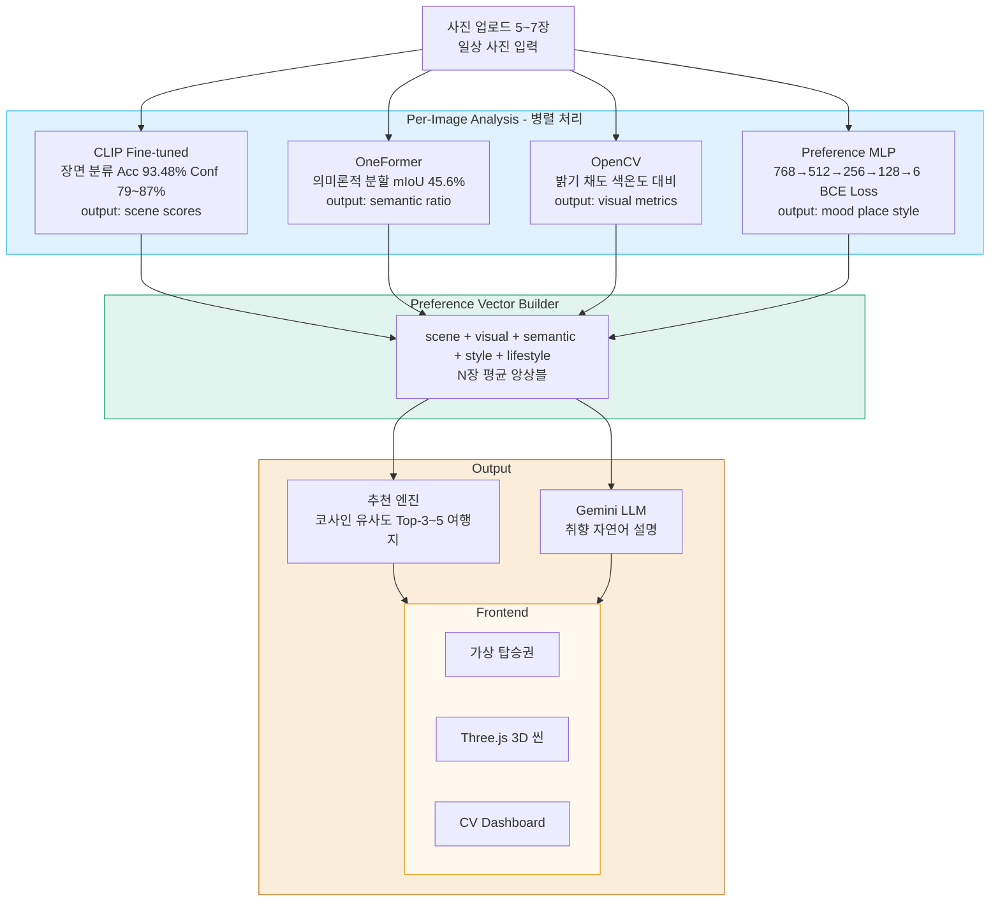
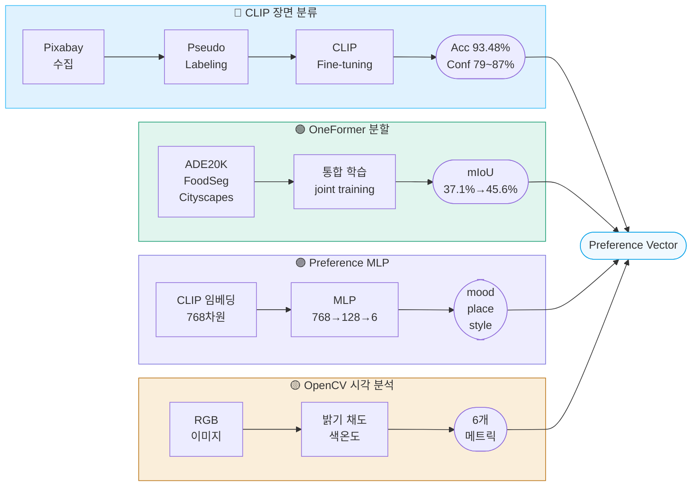

<div align="center">


<br/>


<br/>

> **CLIP · OneFormer · OpenCV · Preference MLP** 를 통합하여 사용자의 잠재적 시각 취향을 분석하고,
> **Preference Vector** 기반 맞춤 여행지를 추천하는 End-to-End AI 서비스

</div>

<br/>

---

## 📋 Table of Contents
- [Demo](#-demo)
- [Why PhotoTrip?](#-why-is-phototrip-different)
- [Why A Single Model Is Not Enough?](#-why-a-single-model-is-not-enough)
- [Preference Vector](#-preference-vector)
- [System Architecture](#️-system-architecture)
- [Tech Stack](#️-tech-stack)
- [Key Contributions](#-key-contributions)
- [Related Work](#-related-work)
- [Model Architecture](#-model-architecture)
- [Experiments & Results](#-experiments--results)
- [Limitations & Future Work](#️-limitations--future-work)
- [Installation & Usage](#-installation--usage)
- [Conclusion](#-conclusion)
- [References](#references)

---

## 🎥 Demo

<p align="center">
  
</p>

<div align="center">

| &nbsp;&nbsp;&nbsp;Category&nbsp;&nbsp;&nbsp; | &nbsp;&nbsp;&nbsp;&nbsp;&nbsp;&nbsp;&nbsp;Demo&nbsp;&nbsp;&nbsp;&nbsp;&nbsp;&nbsp;&nbsp; |
|:---:|:---:|
| 🏙️ &nbsp;City | [▶ Video](https://github.com/user-attachments/assets/2e39bb36-876f-4b46-a000-fc9914e87034) |
| 🏛️ &nbsp;Culture | [▶ Video](https://github.com/user-attachments/assets/aa2ad316-7270-4293-bfdf-e43aabe4dada) |
| 🌿 &nbsp;Nature | [▶ Video](https://github.com/user-attachments/assets/45d3d391-dde3-41f9-a6ee-d80ff77b4c9f) |
| 🍕 &nbsp;Food | [▶ Video](https://github.com/user-attachments/assets/5ef5fe29-4734-4f77-87b2-511de3855b48) |
| 🌊 &nbsp;Beach | [▶ Video](https://github.com/user-attachments/assets/a79cddb6-0e5d-4cad-ab43-86cdc3fb5185) |
| 🎆 &nbsp;Festival | [▶ Video](https://github.com/user-attachments/assets/96f4ace8-f7e2-4662-9a4c-6044df3dc3ec) |

</div>

---

## 🏆 Key Results

<br/>

<!-- ══════════ BOARDING PASS ══════════ -->
<table align="center" width="86%" cellspacing="0" cellpadding="0">
<tr>
<td align="center" bgcolor="#0369A1">
<br/>
<table width="94%" align="center" cellspacing="0" cellpadding="0">
<tr>
<td align="left" width="50%">
&nbsp;&nbsp;<b><font color="#BAE6FD" size="2">✈ PHOTOTRIP AI</font></b>
</td>
<td align="right" width="50%">
<b><font color="#BAE6FD" size="2">BOARDING PASS &nbsp;&nbsp;</font></b>
</td>
</tr>
</table>
<br/>

<table width="94%" align="center" cellspacing="4" cellpadding="0">
<tr>
<td align="center" bgcolor="#BAE6FD" width="50%">
<br/>
<font size="1" color="#0369A1">FROM</font><br/>
<b>일상 사진 5~7장</b><br/>
<font size="1">📱 Daily Gallery</font>
<br/><br/>
</td>
<td align="center" bgcolor="#BAE6FD" width="50%">
<br/>
<font size="1" color="#0369A1">DESTINATION</font><br/>
<b>맞춤 여행지 Top-3</b><br/>
<font size="1">✈️ Personalized Trip</font>
<br/><br/>
</td>
</tr>
</table>

<br/>
<table width="94%" align="center"><tr><td align="center"><font color="#7DD3FC">╌╌╌╌╌╌╌╌╌╌╌╌╌╌╌╌╌╌╌╌╌╌╌╌╌╌╌╌╌╌╌╌╌╌╌╌╌╌╌╌╌╌╌╌╌╌╌╌╌╌╌╌╌╌╌╌╌╌</font></td></tr></table>
<br/>

<table width="94%" align="center" cellspacing="4" cellpadding="0">
<tr>
<td align="center" bgcolor="#E0F2FE" width="33%">
<br/>
<font size="1" color="#0369A1">🎯 CLIP Fine-tuning</font><br/>
<b>93.48%</b><br/>
<font size="1">Accuracy</font>
<br/><br/>
</td>
<td align="center" bgcolor="#E0F2FE" width="33%">
<br/>
<font size="1" color="#0369A1">🧠 Preference MLP</font><br/>
<b>0.9450</b><br/>
<font size="1">Macro F1</font>
<br/><br/>
</td>
<td align="center" bgcolor="#E0F2FE" width="33%">
<br/>
<font size="1" color="#0369A1">🗺️ OneFormer</font><br/>
<b>45.6 mIoU</b><br/>
<font size="1">+8.5%p ↑</font>
<br/><br/>
</td>
</tr>
</table>

<br/>
<table width="94%" align="center"><tr><td align="center"><font color="#7DD3FC">╌╌╌╌╌╌╌╌╌╌╌╌╌╌╌╌╌╌╌╌╌╌╌╌╌╌╌╌╌╌╌╌╌╌╌╌╌╌╌╌╌╌╌╌╌╌╌╌╌╌╌╌╌╌╌╌╌╌</font></td></tr></table>
<br/>

<table width="94%" align="center" cellspacing="4" cellpadding="0">
<tr>
<td align="center" bgcolor="#BAE6FD" width="50%">
<br/>
<font size="1" color="#0369A1">🔁 END-TO-END PIPELINE</font><br/>
<b>Upload → Analyze → Recommend → Visualize</b>
<br/><br/>
</td>
<td align="center" bgcolor="#BAE6FD" width="50%">
<br/>
<font size="1" color="#0369A1">🌐 FRONTEND</font><br/>
<b>Three.js Interactive 3D Scene</b>
<br/><br/>
</td>
</tr>
</table>
<br/>
</td>
</tr>
</table>
<!-- ══════════════════════════════════ -->

<br/>

<p align="center">

</p>
<p align="center">


</p>

---

## 💡 Why Is PhotoTrip Different?

기존 여행 추천 시스템은 **설문조사 · 클릭 로그 · 예약 이력** 등의 명시적 행동 데이터에 의존한다.

반면 PhotoTrip은 사용자가 무의식적으로 촬영한 일상 사진 속에서

- 🏝️ 장소 선호
- 🔲 공간 구성 선호
- 🎨 색감 선호
- 🌤️ 분위기 선호

를 추론한다.

<br/>

<div align="center">
<table width="70%" cellspacing="0" cellpadding="0">
<tr>
<td align="center" bgcolor="#0EA5E9">
<br/>
<b><font color="white" size="3">&nbsp;&nbsp;"사용자의 시각적 취향을 어떻게 표현할 것인가?"&nbsp;&nbsp;</font></b>
<br/><br/>
</td>
</tr>
</table>
</div>

<br/>

핵심은 새로운 모델이 아니라, **표현 방법**이다.

---

## 🔍 Why A Single Model Is Not Enough?

여행 취향은 단일 컴퓨터 비전 모델로 표현할 수 없다.

CLIP은 beach/city를 높은 정확도로 분류할 수 있다. 그러나 **바다의 비율 · 색감 · 분위기 · 공간 구성**은 알 수 없다.

<br/>

<div align="center">
<table width="92%" cellspacing="4" cellpadding="0">
<tr>
<td align="center" bgcolor="#0369A1" width="25%"><br/><b><font color="white">Module</font></b><br/><br/></td>
<td align="center" bgcolor="#0369A1" width="37%"><br/><b><font color="white">✅ 제공하는 정보</font></b><br/><br/></td>
<td align="center" bgcolor="#0369A1" width="37%"><br/><b><font color="white">❌ 제공하지 못하는 정보</font></b><br/><br/></td>
</tr>
<tr>
<td align="center" bgcolor="#E0F2FE"><br/>🔵 CLIP<br/><br/></td>
<td align="center" bgcolor="#F0F9FF"><br/>장면 카테고리 (beach / city / ...)<br/><br/></td>
<td align="center" bgcolor="#FFF1F2"><br/>색감, 분위기, 공간 비율<br/><br/></td>
</tr>
<tr>
<td align="center" bgcolor="#E0F2FE"><br/>🟢 OneFormer<br/><br/></td>
<td align="center" bgcolor="#F0F9FF"><br/>픽셀 단위 의미 구성 비율<br/><br/></td>
<td align="center" bgcolor="#FFF1F2"><br/>감성적 선호, 분위기<br/><br/></td>
</tr>
<tr>
<td align="center" bgcolor="#E0F2FE"><br/>🟡 OpenCV<br/><br/></td>
<td align="center" bgcolor="#F0F9FF"><br/>밝기 / 채도 / 색온도<br/><br/></td>
<td align="center" bgcolor="#FFF1F2"><br/>장소 의미, 맥락<br/><br/></td>
</tr>
<tr>
<td align="center" bgcolor="#E0F2FE"><br/>🟣 Pref. MLP<br/><br/></td>
<td align="center" bgcolor="#F0F9FF"><br/>분위기 / 라이프스타일 벡터<br/><br/></td>
<td align="center" bgcolor="#FFF1F2"><br/>공간 구조, 장소 범주<br/><br/></td>
</tr>
</table>
</div>

<br/>

PhotoTrip은 **Scene + Semantic + Visual + Style** 네 가지 정보를 통합하여 단일 모델이 표현할 수 없는 여행 취향을 분석한다.

<br/>

<div align="center">
<table width="92%" cellspacing="4" cellpadding="0">
<tr>
<td align="center" bgcolor="#0369A1" width="22%"><br/><b><font color="white">Module</font></b><br/><br/></td>
<td align="center" bgcolor="#0369A1" width="26%"><br/><b><font color="white">추출 정보</font></b><br/><br/></td>
<td align="center" bgcolor="#0369A1" width="22%"><br/><b><font color="white">성능</font></b><br/><br/></td>
<td align="center" bgcolor="#0369A1" width="30%"><br/><b><font color="white">단독 사용 시 한계</font></b><br/><br/></td>
</tr>
<tr>
<td align="center" bgcolor="#DBEAFE"><br/>🔵 CLIP<br/><br/></td>
<td align="center" bgcolor="#EFF6FF"><br/>Scene Category<br/><br/></td>
<td align="center" bgcolor="#EFF6FF"><br/>93.48% Acc<br/><br/></td>
<td align="center" bgcolor="#EFF6FF"><br/>발리 ≠ 제주 구분 불가<br/><br/></td>
</tr>
<tr>
<td align="center" bgcolor="#DBEAFE"><br/>🟢 OneFormer<br/><br/></td>
<td align="center" bgcolor="#EFF6FF"><br/>Semantic Composition<br/><br/></td>
<td align="center" bgcolor="#EFF6FF"><br/>45.6 mIoU<br/><br/></td>
<td align="center" bgcolor="#EFF6FF"><br/>감성적 선호 표현 불가<br/><br/></td>
</tr>
<tr>
<td align="center" bgcolor="#DBEAFE"><br/>🟡 OpenCV<br/><br/></td>
<td align="center" bgcolor="#EFF6FF"><br/>Brightness / Saturation<br/><br/></td>
<td align="center" bgcolor="#EFF6FF"><br/>6 Visual Metrics<br/><br/></td>
<td align="center" bgcolor="#EFF6FF"><br/>장소 의미 이해 불가<br/><br/></td>
</tr>
<tr>
<td align="center" bgcolor="#DBEAFE"><br/>🟣 Pref. MLP<br/><br/></td>
<td align="center" bgcolor="#EFF6FF"><br/>Mood / Lifestyle<br/><br/></td>
<td align="center" bgcolor="#EFF6FF"><br/>Macro F1 0.9450<br/><br/></td>
<td align="center" bgcolor="#EFF6FF"><br/>공간 구조 파악 불가<br/><br/></td>
</tr>
</table>
</div>

---

## 🧠 Preference Vector

CLIP · OneFormer · OpenCV · Preference MLP의 출력을 하나의 **Preference Vector**로 통합한다.

Preference Vector는 총 **44차원**으로 구성되며, 각 차원이 명확한 의미를 갖는 해석 가능한(interpretable) 표현 공간을 형성한다.

<br/>

<div align="center">
<table width="88%" cellspacing="4" cellpadding="0">
<tr>
<td align="center" bgcolor="#0369A1" width="20%"><br/><b><font color="white">그룹</font></b><br/><br/></td>
<td align="center" bgcolor="#0369A1" width="65%"><br/><b><font color="white">구성 요소</font></b><br/><br/></td>
<td align="center" bgcolor="#0369A1" width="15%"><br/><b><font color="white">차원</font></b><br/><br/></td>
</tr>
<tr>
<td align="center" bgcolor="#BAE6FD"><br/>scene<br/><br/></td>
<td align="left" bgcolor="#E0F2FE"><br/>&nbsp;&nbsp;beach / nature / city / culture / festival / food<br/><br/></td>
<td align="center" bgcolor="#E0F2FE"><br/><b>6</b><br/><br/></td>
</tr>
<tr>
<td align="center" bgcolor="#BAE6FD"><br/>visual<br/><br/></td>
<td align="left" bgcolor="#E0F2FE"><br/>&nbsp;&nbsp;brightness / saturation / contrast / warm_tone / person_ratio / animal_ratio<br/><br/></td>
<td align="center" bgcolor="#E0F2FE"><br/><b>6</b><br/><br/></td>
</tr>
<tr>
<td align="center" bgcolor="#BAE6FD"><br/>semantic<br/><br/></td>
<td align="left" bgcolor="#E0F2FE"><br/>&nbsp;&nbsp;water / sky / vegetation / building / food<br/><br/></td>
<td align="center" bgcolor="#E0F2FE"><br/><b>5</b><br/><br/></td>
</tr>
<tr>
<td align="center" bgcolor="#BAE6FD"><br/>style (MLP)<br/><br/></td>
<td align="left" bgcolor="#E0F2FE"><br/>&nbsp;&nbsp;calm / cozy / romantic / energetic / local / aesthetic<br/><br/></td>
<td align="center" bgcolor="#E0F2FE"><br/><b>6</b><br/><br/></td>
</tr>
<tr>
<td align="center" bgcolor="#BAE6FD"><br/>place<br/><br/></td>
<td align="left" bgcolor="#E0F2FE"><br/>&nbsp;&nbsp;beach / nature / city / food / festival / culture<br/><br/></td>
<td align="center" bgcolor="#E0F2FE"><br/><b>6</b><br/><br/></td>
</tr>
<tr>
<td align="center" bgcolor="#BAE6FD"><br/>mood<br/><br/></td>
<td align="left" bgcolor="#E0F2FE"><br/>&nbsp;&nbsp;calm / cozy / romantic / energetic / local / aesthetic<br/><br/></td>
<td align="center" bgcolor="#E0F2FE"><br/><b>6</b><br/><br/></td>
</tr>
<tr>
<td align="center" bgcolor="#BAE6FD"><br/>interest<br/><br/></td>
<td align="left" bgcolor="#E0F2FE"><br/>&nbsp;&nbsp;anime / disney / sports / cafe / shopping / nightlife / art / history / local_market<br/><br/></td>
<td align="center" bgcolor="#E0F2FE"><br/><b>9</b><br/><br/></td>
</tr>
<tr>
<td align="center" bgcolor="#0EA5E9"><br/><b><font color="white">합계</font></b><br/><br/></td>
<td align="center" bgcolor="#0EA5E9"><br/></td>
<td align="center" bgcolor="#0EA5E9"><br/><b><font color="white">44</font></b><br/><br/></td>
</tr>
</table>
</div>

<br/>

여행지 프로필은 각 목적지의 특성을 동일한 44차원 축으로 수작업 정의한 벡터이며, 사용자 Preference Vector와 코사인 유사도로 매칭한다.

### Example

**입력 사진** — 카페 · 바다 · 노을 · 음식

↓ 멀티모달 분석

**Preference Vector**

```json
{
  "beach": 0.82,
  "nature": 0.11,
  "water": 0.43,
  "vegetation": 0.21,
  "warm_tone": 0.79,
  "saturation": 0.74,
  "vibrant": 0.68,
  "cozy": 0.14
}
```

↓ 코사인 유사도 기반 매칭

**추천 결과**

1. 🌴 Bali
2. 🏖️ Phuket
3. 🌊 Cebu

↓ Gemini 자연어 설명

> "따뜻한 색감과 활기찬 분위기를 선호하는 경향이 강합니다.  
> 바다와 음식이 어우러지는 리조트형 여행지가 잘 맞을 것 같습니다."

---

## 🏗️ System Architecture



### 카테고리별 분석 예시

<div align="center">
<table width="88%" cellspacing="4" cellpadding="0">
<tr>
<td align="center" bgcolor="#0369A1"><br/><b><font color="white">입력 사진 특성</font></b><br/><br/></td>
<td align="center" bgcolor="#0369A1"><br/><b><font color="white">분류 결과</font></b><br/><br/></td>
<td align="center" bgcolor="#0369A1"><br/><b><font color="white">추천 여행지 예시</font></b><br/><br/></td>
</tr>
<tr>
<td align="center" bgcolor="#E0F2FE"><br/>해변, 바다, 모래<br/><br/></td>
<td align="center" bgcolor="#BAE6FD"><br/><b>🏖️ beach</b><br/><br/></td>
<td align="center" bgcolor="#E0F2FE"><br/>발리, 몰디브, 제주<br/><br/></td>
</tr>
<tr>
<td align="center" bgcolor="#E0F2FE"><br/>산, 숲, 자연<br/><br/></td>
<td align="center" bgcolor="#BAE6FD"><br/><b>🌲 nature</b><br/><br/></td>
<td align="center" bgcolor="#E0F2FE"><br/>퀸스타운, 파타고니아, 설악산<br/><br/></td>
</tr>
<tr>
<td align="center" bgcolor="#E0F2FE"><br/>도시, 야경, 빌딩<br/><br/></td>
<td align="center" bgcolor="#BAE6FD"><br/><b>🌆 city</b><br/><br/></td>
<td align="center" bgcolor="#E0F2FE"><br/>도쿄, 홍콩, 파리<br/><br/></td>
</tr>
<tr>
<td align="center" bgcolor="#E0F2FE"><br/>사원, 박물관, 문화유산<br/><br/></td>
<td align="center" bgcolor="#BAE6FD"><br/><b>🏛️ culture</b><br/><br/></td>
<td align="center" bgcolor="#E0F2FE"><br/>교토, 로마, 이스탄불<br/><br/></td>
</tr>
<tr>
<td align="center" bgcolor="#E0F2FE"><br/>공연, 축제, 음악<br/><br/></td>
<td align="center" bgcolor="#BAE6FD"><br/><b>🎪 festival</b><br/><br/></td>
<td align="center" bgcolor="#E0F2FE"><br/>밀라노, 에든버러, 라스베가스<br/><br/></td>
</tr>
<tr>
<td align="center" bgcolor="#E0F2FE"><br/>음식, 카페, 길거리 음식<br/><br/></td>
<td align="center" bgcolor="#BAE6FD"><br/><b>🍜 food</b><br/><br/></td>
<td align="center" bgcolor="#E0F2FE"><br/>나폴리, 방콕, 오사카<br/><br/></td>
</tr>
</table>
</div>

---

## 🛠️ Tech Stack

<br/>

<div align="center">
<table width="82%" cellspacing="4" cellpadding="0">
<tr>
<td align="center" bgcolor="#0369A1" width="30%"><br/><b><font color="white">계층</font></b><br/><br/></td>
<td align="center" bgcolor="#0369A1" width="70%"><br/><b><font color="white">기술</font></b><br/><br/></td>
</tr>
<tr>
<td align="center" bgcolor="#BAE6FD"><br/>⚙️ &nbsp;<b>Backend</b><br/><br/></td>
<td align="left" bgcolor="#E0F2FE"><br/>&nbsp;&nbsp;FastAPI &nbsp;·&nbsp; PyTorch &nbsp;·&nbsp; HuggingFace Transformers<br/><br/></td>
</tr>
<tr>
<td align="center" bgcolor="#BAE6FD"><br/>🔵 &nbsp;<b>장면 분류</b><br/><br/></td>
<td align="left" bgcolor="#E0F2FE"><br/>&nbsp;&nbsp;CLIP ViT-B/32 fine-tuned<br/><br/></td>
</tr>
<tr>
<td align="center" bgcolor="#BAE6FD"><br/>🟢 &nbsp;<b>의미론적 분할</b><br/><br/></td>
<td align="left" bgcolor="#E0F2FE"><br/>&nbsp;&nbsp;OneFormer (swin_large)<br/><br/></td>
</tr>
<tr>
<td align="center" bgcolor="#BAE6FD"><br/>🟡 &nbsp;<b>시각 분석</b><br/><br/></td>
<td align="left" bgcolor="#E0F2FE"><br/>&nbsp;&nbsp;OpenCV<br/><br/></td>
</tr>
<tr>
<td align="center" bgcolor="#BAE6FD"><br/>🟣 &nbsp;<b>분위기·취향</b><br/><br/></td>
<td align="left" bgcolor="#E0F2FE"><br/>&nbsp;&nbsp;Preference MLP &nbsp;·&nbsp; BCE Loss &nbsp;·&nbsp; Pseudo Labeling<br/><br/></td>
</tr>
<tr>
<td align="center" bgcolor="#BAE6FD"><br/>💬 &nbsp;<b>LLM</b><br/><br/></td>
<td align="left" bgcolor="#E0F2FE"><br/>&nbsp;&nbsp;Google Gemini API<br/><br/></td>
</tr>
<tr>
<td align="center" bgcolor="#BAE6FD"><br/>🌐 &nbsp;<b>Frontend</b><br/><br/></td>
<td align="left" bgcolor="#E0F2FE"><br/>&nbsp;&nbsp;Three.js &nbsp;·&nbsp; HTML / CSS / JS<br/><br/></td>
</tr>
<tr>
<td align="center" bgcolor="#BAE6FD"><br/>☁️ &nbsp;<b>학습 환경</b><br/><br/></td>
<td align="left" bgcolor="#E0F2FE"><br/>&nbsp;&nbsp;Google Colab &nbsp;·&nbsp; Kaggle (GPU)<br/><br/></td>
</tr>
</table>
</div>

<br/>

---

## 💡 Key Contributions

<details>
<summary>&nbsp;1️⃣ &nbsp;<b>멀티모달 Preference Vector 설계 및 앙상블</b></summary>
<br/>

CLIP · OneFormer · OpenCV · Preference MLP 4개 이질적 모듈의 출력을 단일 Preference Vector로 통합하는 구조를 직접 설계.
scene(6) · visual(6) · semantic(5) · style · lifestyle을 하나의 벡터로 표현하며, 5~7장 입력 시 per-image 벡터를 평균 앙상블하여 노이즈에 robust한 취향 표현을 구축.

OpenCV 색감 분석(밝기·채도·색온도·대비)과 Preference MLP 출력을 여행지 프로필과 코사인 유사도로 매칭함으로써, CV 분석 결과가 직접 추천에 반영되는 end-to-end 파이프라인 완성.
*(예: 따뜻한 색감 + vibrant 스타일 → 발리·방콕 추천)*

scene 분류는 CLIP fine-tuning, place · mood · interest는 zero-shot 전이를 활용하였다.

</details>

<details>
<summary>&nbsp;2️⃣ &nbsp;<b>Accuracy–Confidence 트레이드오프 실험 설계</b></summary>
<br/>

SigLIP과 CLIP을 동일 데이터셋에서 fine-tuning 후 val accuracy와 inference confidence를 직접 비교.
SigLIP은 accuracy 93.56%에도 confidence가 33~37%에 머물러 Preference Vector 품질을 저하시킴을 확인.
CLIP fine-tuned는 93.48% accuracy + 79~87% confidence로 최종 채택.
총 5가지 실험 변형(Pseudo Labeling, large 데이터, festival 추가 등)을 직접 설계·수행.

</details>

<details>
<summary>&nbsp;3️⃣ &nbsp;<b>OneFormer 멀티데이터셋 학습 파이프라인 설계</b></summary>
<br/>

ADE20K · FoodSeg103 · Cityscapes를 단일 모델로 통합 학습하기 위해 Mask2Former 대신 OneFormer를 직접 선택·적용.
Travel-class mIoU 37.1% → 45.6% (+8.5%p) 달성.

</details>

<details>
<summary>&nbsp;4️⃣ &nbsp;<b>Pseudo Labeling 데이터 파이프라인 구축</b></summary>
<br/>

Pixabay API 수집 → SigLIP 자동 라벨링 → confidence 필터링 전 과정을 직접 설계 및 구현.

</details>

<details>
<summary>&nbsp;5️⃣ &nbsp;<b>Preference MLP 설계 및 실험</b></summary>
<br/>

BCE Loss + class weights로 클래스 불균형을 처리하고, mood · place · style 3개 Preference MLP를 독립적으로 설계.
CLIP 임베딩(768차원) → 6-class multilabel 분류.
Place Preference MLP Macro F1 **0.9450** 달성.

</details>

---

## 📚 Related Work

### Semantic Segmentation 발전

<div align="center">
<table width="88%" cellspacing="4" cellpadding="0">
<tr>
<td align="center" bgcolor="#0369A1" width="12%"><br/><b><font color="white">연도</font></b><br/><br/></td>
<td align="center" bgcolor="#0369A1" width="22%"><br/><b><font color="white">모델</font></b><br/><br/></td>
<td align="center" bgcolor="#0369A1" width="66%"><br/><b><font color="white">주요 기여</font></b><br/><br/></td>
</tr>
<tr>
<td align="center" bgcolor="#E0F2FE"><br/>2015<br/><br/></td>
<td align="center" bgcolor="#BAE6FD"><br/><b>FCN</b><br/><br/></td>
<td align="left" bgcolor="#E0F2FE"><br/>&nbsp;&nbsp;최초 end-to-end 픽셀 단위 분류<br/><br/></td>
</tr>
<tr>
<td align="center" bgcolor="#E0F2FE"><br/>2017<br/><br/></td>
<td align="center" bgcolor="#BAE6FD"><br/><b>DeepLab v3</b><br/><br/></td>
<td align="left" bgcolor="#E0F2FE"><br/>&nbsp;&nbsp;Atrous convolution, multi-scale context 도입<br/><br/></td>
</tr>
<tr>
<td align="center" bgcolor="#E0F2FE"><br/>2022<br/><br/></td>
<td align="center" bgcolor="#BAE6FD"><br/><b>Mask2Former</b><br/><br/></td>
<td align="left" bgcolor="#E0F2FE"><br/>&nbsp;&nbsp;Universal segmentation 시도; 단, 태스크마다 개별 학습 필요<br/><br/></td>
</tr>
<tr>
<td align="center" bgcolor="#E0F2FE"><br/>2023<br/><br/></td>
<td align="center" bgcolor="#7DD3FC"><br/><b>OneFormer ✅</b><br/><br/></td>
<td align="left" bgcolor="#DBEAFE"><br/>&nbsp;&nbsp;Task-conditioned joint training으로 단일 모델 멀티 태스크 가능<br/><br/></td>
</tr>
</table>
</div>

<br/>

### OneFormer 채택 배경

OneFormer(Jain et al., CVPR 2023)는 task-conditioned joint training으로 semantic · instance · panoptic segmentation을 단일 모델로 처리한다.

| 카테고리 | 학습 데이터셋 | 도메인 |
|---------|------------|--------|
| 자연/도시/문화 | ADE20K | 실내외 범용 장면 |
| 음식 | FoodSeg103 | 음식 특화 |
| 도시/도로 | Cityscapes | 도시 주행 장면 |

Mask2Former는 태스크마다 별도 모델이 필요하여 최소 3배의 GPU 메모리·학습 시간이 요구된다.

### Vision-Language Models

CLIP(Radford et al., 2021)은 4억 쌍의 이미지-텍스트 대조 학습으로 강력한 zero-shot 전이 성능을 제공하며, softmax 기반 confidence로 취향 신호를 명확하게 전달한다.

SigLIP(Zhai et al., 2023)은 sigmoid loss로 학습 안정성을 개선하였으나, inference confidence가 33~37%에 머물러 Preference Vector 품질을 저하시킨다.

---

## 🧠 Model Architecture



---

## 🔬 Experiments & Results

### 1. 장면 분류 (Scene Classification)

6-class 여행 장면 분류: beach · nature · city · culture · festival · food

<div align="center">
<table width="88%" cellspacing="4" cellpadding="0">
<tr>
<td align="center" bgcolor="#0369A1" width="40%"><br/><b><font color="white">모델</font></b><br/><br/></td>
<td align="center" bgcolor="#0369A1" width="25%"><br/><b><font color="white">Val Accuracy</font></b><br/><br/></td>
<td align="center" bgcolor="#0369A1" width="35%"><br/><b><font color="white">비고</font></b><br/><br/></td>
</tr>
<tr>
<td align="center" bgcolor="#F1F5F9"><br/>CLIP Zero-shot<br/><br/></td>
<td align="center" bgcolor="#F1F5F9"><br/>64.27%<br/><br/></td>
<td align="center" bgcolor="#F1F5F9"><br/>프롬프트 기반, fine-tuning 없음<br/><br/></td>
</tr>
<tr>
<td align="center" bgcolor="#F1F5F9"><br/>SigLIP 기본<br/><br/></td>
<td align="center" bgcolor="#F1F5F9"><br/>90.91%<br/><br/></td>
<td align="center" bgcolor="#F1F5F9"><br/>google/siglip-large-patch16-256<br/><br/></td>
</tr>
<tr>
<td align="center" bgcolor="#F1F5F9"><br/>SigLIP + large 데이터<br/><br/></td>
<td align="center" bgcolor="#F1F5F9"><br/>90.52%<br/><br/></td>
<td align="center" bgcolor="#F1F5F9"><br/>데이터 규모 확대 시 소폭 하락<br/><br/></td>
</tr>
<tr>
<td align="center" bgcolor="#F1F5F9"><br/>SigLIP + festival 카테고리<br/><br/></td>
<td align="center" bgcolor="#F1F5F9"><br/>93.56%<br/><br/></td>
<td align="center" bgcolor="#F1F5F9"><br/>festival 클래스 추가<br/><br/></td>
</tr>
<tr>
<td align="center" bgcolor="#F1F5F9"><br/>SigLIP + Pseudo Labeling<br/><br/></td>
<td align="center" bgcolor="#F1F5F9"><br/>93.14%<br/><br/></td>
<td align="center" bgcolor="#F1F5F9"><br/>pseudo label 기반 semi-supervised<br/><br/></td>
</tr>
<tr>
<td align="center" bgcolor="#7DD3FC"><br/><b>CLIP Fine-tuned</b><br/><br/></td>
<td align="center" bgcolor="#38BDF8"><br/><b><font color="white">93.48% ✅</font></b><br/><br/></td>
<td align="center" bgcolor="#7DD3FC"><br/><b>openai/clip-vit-base-patch32</b><br/><br/></td>
</tr>
</table>
</div>

<br/>

> **CLIP 채택 근거**: accuracy parity 조건 하에서 SigLIP(33~37%) 대비 CLIP(79~87%)의 월등한 inference confidence가 Preference Vector 품질에 직결됨.

<p align="center">
  
</p>
<p align="center">
  
  
</p>

---

### 2. 의미론적 분할 (Semantic Segmentation)

<div align="center">
<table width="88%" cellspacing="4" cellpadding="0">
<tr>
<td align="center" bgcolor="#0369A1"><br/><b><font color="white">모델</font></b><br/><br/></td>
<td align="center" bgcolor="#0369A1"><br/><b><font color="white">mIoU</font></b><br/><br/></td>
<td align="center" bgcolor="#0369A1"><br/><b><font color="white">학습 데이터</font></b><br/><br/></td>
<td align="center" bgcolor="#0369A1"><br/><b><font color="white">비고</font></b><br/><br/></td>
</tr>
<tr>
<td align="center" bgcolor="#F1F5F9"><br/>OneFormer pretrained<br/><br/></td>
<td align="center" bgcolor="#F1F5F9"><br/>37.1%<br/><br/></td>
<td align="center" bgcolor="#F1F5F9"><br/>ADE20K<br/><br/></td>
<td align="center" bgcolor="#F1F5F9"><br/>기준선<br/><br/></td>
</tr>
<tr>
<td align="center" bgcolor="#7DD3FC"><br/><b>OneFormer fine-tuned</b><br/><br/></td>
<td align="center" bgcolor="#38BDF8"><br/><b><font color="white">45.6% ✅</font></b><br/><br/></td>
<td align="center" bgcolor="#7DD3FC"><br/>ADE20K + FoodSeg103 + Cityscapes<br/><br/></td>
<td align="center" bgcolor="#7DD3FC"><br/><b>최종 채택</b><br/><br/></td>
</tr>
</table>
</div>

<br/>

- **모델**: `shi-labs/oneformer_ade20k_swin_large`
- **목적**: ADE20K 클래스를 travel-relevant semantic ratio (water, sky, vegetation, building, food)로 집계
- **학습 전략**: 3개 이질적 도메인을 task-conditioned joint training으로 단일 모델 통합 학습

<p align="center">
  
</p>
<p align="center">
  
</p>

---

### 3. Preference MLP

| 항목 | 설정 |
|------|------|
| 입력 | CLIP image embedding (768-dim) |
| 구조 | MLP 768→512→256→128→6, multilabel sigmoid |
| 손실 함수 | BCE Loss with class weights (희소 클래스 보정) |
| 데이터 | Pseudo Labeling pipeline (v3 generator) |
| 샘플러 | Rare-class weighted sampler |

<br/>

<div align="center">
<table width="52%" cellspacing="4" cellpadding="0">
<tr>
<td align="center" bgcolor="#0369A1" width="50%"><br/><b><font color="white">Category</font></b><br/><br/></td>
<td align="center" bgcolor="#0369A1" width="50%"><br/><b><font color="white">F1 Score</font></b><br/><br/></td>
</tr>
<tr><td align="center" bgcolor="#E0F2FE"><br/>Nature<br/><br/></td><td align="center" bgcolor="#BAE6FD"><br/><b>0.97</b><br/><br/></td></tr>
<tr><td align="center" bgcolor="#E0F2FE"><br/>Food<br/><br/></td><td align="center" bgcolor="#BAE6FD"><br/><b>0.97</b><br/><br/></td></tr>
<tr><td align="center" bgcolor="#E0F2FE"><br/>Beach<br/><br/></td><td align="center" bgcolor="#BAE6FD"><br/><b>0.95</b><br/><br/></td></tr>
<tr><td align="center" bgcolor="#E0F2FE"><br/>Festival<br/><br/></td><td align="center" bgcolor="#BAE6FD"><br/><b>0.95</b><br/><br/></td></tr>
<tr><td align="center" bgcolor="#E0F2FE"><br/>Culture<br/><br/></td><td align="center" bgcolor="#BAE6FD"><br/><b>0.93</b><br/><br/></td></tr>
<tr><td align="center" bgcolor="#E0F2FE"><br/>City<br/><br/></td><td align="center" bgcolor="#BAE6FD"><br/><b>0.91</b><br/><br/></td></tr>
<tr><td align="center" bgcolor="#7DD3FC"><br/><b>Macro F1</b><br/><br/></td><td align="center" bgcolor="#38BDF8"><br/><b><font color="white">0.9450</font></b><br/><br/></td></tr>
<tr><td align="center" bgcolor="#7DD3FC"><br/><b>Micro F1</b><br/><br/></td><td align="center" bgcolor="#7DD3FC"><br/><b>0.9457</b><br/><br/></td></tr>
<tr><td align="center" bgcolor="#7DD3FC"><br/><b>Weighted F1</b><br/><br/></td><td align="center" bgcolor="#7DD3FC"><br/><b>0.9460</b><br/><br/></td></tr>
</table>
</div>

<br/>

<p align="center">
  
</p>

---

### 4. 종합 결과

<div align="center">
<table width="92%" cellspacing="4" cellpadding="0">
<tr>
<td align="center" bgcolor="#0369A1" width="22%"><br/><b><font color="white">모듈</font></b><br/><br/></td>
<td align="center" bgcolor="#0369A1" width="38%"><br/><b><font color="white">모델</font></b><br/><br/></td>
<td align="center" bgcolor="#0369A1" width="40%"><br/><b><font color="white">성능</font></b><br/><br/></td>
</tr>
<tr>
<td align="center" bgcolor="#BAE6FD"><br/>🔵 장면 분류<br/><br/></td>
<td align="center" bgcolor="#E0F2FE"><br/>CLIP ViT-B/32 fine-tuned<br/><br/></td>
<td align="center" bgcolor="#E0F2FE"><br/>Val Acc 93.48% · Conf 79~87%<br/><br/></td>
</tr>
<tr>
<td align="center" bgcolor="#BAE6FD"><br/>🟢 의미론적 분할<br/><br/></td>
<td align="center" bgcolor="#E0F2FE"><br/>OneFormer swin-large<br/><br/></td>
<td align="center" bgcolor="#E0F2FE"><br/>Travel-class mIoU 45.6% (+8.5%p)<br/><br/></td>
</tr>
<tr>
<td align="center" bgcolor="#BAE6FD"><br/>🟣 분위기·취향<br/><br/></td>
<td align="center" bgcolor="#E0F2FE"><br/>Preference MLP (768→6)<br/><br/></td>
<td align="center" bgcolor="#E0F2FE"><br/>Macro F1 0.9450 · Weighted F1 0.9460<br/><br/></td>
</tr>
<tr>
<td align="center" bgcolor="#BAE6FD"><br/>🟡 시각 특성<br/><br/></td>
<td align="center" bgcolor="#E0F2FE"><br/>OpenCV<br/><br/></td>
<td align="center" bgcolor="#E0F2FE"><br/>밝기·채도·색온도·대비 6개 메트릭<br/><br/></td>
</tr>
<tr>
<td align="center" bgcolor="#BAE6FD"><br/>🎯 추천 엔진<br/><br/></td>
<td align="center" bgcolor="#E0F2FE"><br/>코사인 유사도<br/><br/></td>
<td align="center" bgcolor="#E0F2FE"><br/>Top-3~5 여행지 선정<br/><br/></td>
</tr>
<tr>
<td align="center" bgcolor="#BAE6FD"><br/>🔁 앙상블<br/><br/></td>
<td align="center" bgcolor="#E0F2FE"><br/>per-image 평균<br/><br/></td>
<td align="center" bgcolor="#E0F2FE"><br/>5~7장 입력 기준<br/><br/></td>
</tr>
</table>
</div>

---

## ⚠️ Limitations & Future Work

### Limitations

<details>
<summary>&nbsp;<b>1. Coarse-Grained Travel Preference Representation</b></summary>
<br/>

본 시스템은 데이터 수집 가능성과 모델 복잡도를 고려하여 beach, nature, city, culture, festival, food의 6개 카테고리 기반 taxonomy를 사용한다.

그러나 실제 여행 취향은 카테고리 간 경계가 명확하지 않으며, 동일한 카테고리 내에서도 다양한 세부 선호가 존재한다. 예를 들어 beach 선호 사용자는 리조트 중심 휴양형, 자연 경관 중심 탐방형, 액티비티 중심 체험형 등 서로 다른 취향을 가질 수 있다.

</details>

<details>
<summary>&nbsp;<b>2. Multi-Domain Evaluation Limitation</b></summary>
<br/>

OneFormer는 ADE20K, FoodSeg103, Cityscapes를 통합하여 학습되었으나, 여행 취향 분석을 위한 통합 평가 벤치마크는 존재하지 않는다. 따라서 멀티 도메인 환경에서의 종합적인 성능을 정량적으로 평가하는 데 한계가 있다.

</details>

<details>
<summary>&nbsp;<b>3. Pseudo Labeling Noise</b></summary>
<br/>

스타일 분류 학습 데이터는 Pixabay 이미지와 자동 라벨링 기반으로 구축되었다. Confidence 기반 필터링을 적용하였음에도 불구하고 데이터 편향 및 라벨 노이즈가 일부 잔존할 수 있다.

</details>

<details>
<summary>&nbsp;<b>4. Limitation of Hand-Crafted Preference Vector</b></summary>
<br/>

현재 Preference Vector는 사람이 직접 설계한 특징 공간을 사용한다. 해석 가능성이 높다는 장점이 있으나, 실제 사용자의 잠재적 취향을 완전히 표현하지 못할 가능성이 있다.

</details>

<details>
<summary>&nbsp;<b>5. Dependency on External APIs</b></summary>
<br/>

Gemini API 기반 자연어 설명 기능은 외부 서비스 의존성을 가진다. API 장애 또는 정책 변경 시 서비스 품질에 영향을 받을 수 있다.

</details>

<details>
<summary>&nbsp;<b>6. Subjectivity of Style Labels</b></summary>
<br/>

분위기(mood), 라이프스타일(style), 장소 감성(place)은 본질적으로 주관적인 개념이다. 현재의 자동 라벨링 기반 접근은 개인차를 충분히 반영하지 못한다.

</details>

<br/>

### Future Work

<details>
<summary>&nbsp;<b>1. Learnable Preference Embedding</b></summary>
<br/>

사용자 이미지와 여행지 이미지를 동일한 임베딩 공간으로 학습하여 수작업 특징 설계 없이 여행 취향을 직접 학습하는 Learnable Preference Embedding으로 확장할 수 있다.

</details>

<details>
<summary>&nbsp;<b>2. Personalized Feedback Loop</b></summary>
<br/>

사용자 피드백을 통해 Preference Vector를 지속적으로 업데이트하여 개인화 성능을 향상할 수 있다. 스타일 라벨의 주관성 문제를 개인화로 점진적으로 해결 가능하다.

</details>

<details>
<summary>&nbsp;<b>3. Large-Scale Destination Retrieval</b></summary>
<br/>

사전 정의 여행지 대신 대규모 여행지 이미지 데이터베이스를 활용한 Retrieval 기반 추천으로 확장할 수 있다.

</details>

<details>
<summary>&nbsp;<b>4. 계층적 카테고리 확장</b></summary>
<br/>

6개 → 세부 하위 테마로 확장 (예: beach → 리조트형 / 자연형 / 액티비티형)

</details>

---

## 🚀 Installation & Usage

### Requirements

- Python 3.10+
- CUDA-capable GPU (권장)
- Google Gemini API Key

### Installation

```bash
git clone https://github.com/your-username/PhotoTrip.git
cd PhotoTrip

python -m venv venv
# Windows
venv\Scripts\activate
# Linux / macOS
source venv/bin/activate

pip install -r requirements.txt
```

### Environment Variables

프로젝트 루트에 `.env` 파일을 생성한다.

```env
GOOGLE_API_KEY=your_gemini_api_key
```

### Model Weights

아래 모델 파일을 `models/` 디렉터리에 배치한다.

```
models/
├── best_clip.pth              # CLIP fine-tuned (장면 분류)
├── best_siglip.pth            # SigLIP fine-tuned (실험용)
├── mlp_mood_best.pth          # Preference MLP mood 분류
├── mlp_place_best.pth         # Preference MLP place 분류
├── mlp_style_best.pth         # Preference MLP style 분류
└── oneformer_top/             # OneFormer fine-tuned
    ├── config.json
    ├── model.safetensors
    ├── processor_config.json
    ├── tokenizer.json
    └── tokenizer_config.json
```

### Run Server

```bash
python -m uvicorn backend.main:app --reload --port 8000
```

브라우저에서 `http://localhost:8000` 접속.

### Usage Flow

1. 메인 화면 바코드 클릭 → 업로드 화면 이동
2. 일상 사진 **5~7장** 업로드
3. **AI 분석 시작** 클릭 → 로딩
4. 결과 화면:
   - 좌측: Three.js 3D 씬 + CV Analysis 대시보드
   - 우측: Gemini 취향 설명 + Flying 챗봇 + 가상 탑승권

### Fine-tuning (Optional)

```bash
# CLIP 장면 분류 fine-tuning
python classification/clip_finetune.py \
    --train_dir data/train \
    --val_dir data/val \
    --epochs 10 \
    --batch_size 32 \
    --lr 1e-5

# SigLIP fine-tuning (실험용)
python classification/siglip_finetune.py \
    --train_dir data/train \
    --val_dir data/val \
    --epochs 10

# OneFormer fine-tuning
# Kaggle 환경 권장 (GPU 메모리 24GB+)
```

---

## 📝 Conclusion

PhotoTrip의 핵심 기여는 새로운 비전 모델의 제안이 아니라,  
장면 의미(CLIP) · 공간 구성(OneFormer) · 시각 특성(OpenCV) · 분위기 선호(Preference MLP)를  
Preference Vector로 통합하여 사용자의 잠재적 여행 취향을  
정량화한 **멀티모달 취향 추론 프레임워크**에 있다.

기존 여행 추천 시스템이 명시적 행동 데이터에 의존했다면,  
PhotoTrip은 사용자의 일상 사진으로부터 잠재적 시각 취향을 추론하고,  
이를 설명 가능한 형태의 Preference Vector로 표현한다.

단일 모델이 포착할 수 없는 장소 의미 · 공간 구성 · 색감 · 분위기를  
네 가지 이질적 모듈의 출력으로 분산 표현하고,  
이를 하나의 벡터로 통합함으로써  
사용자의 잠재적 여행 취향을 정량화하는 새로운 접근을 제시한다.

---

## References

### 사용 모델

1. Radford, A., et al. (2021). *Learning Transferable Visual Models From Natural Language Supervision.* ICML. [(링크)](https://arxiv.org/abs/2103.00020)
2. Zhai, X., et al. (2023). *Sigmoid Loss for Language Image Pre-Training.* ICCV. [(링크)](https://arxiv.org/abs/2303.15343)
3. Jain, J., et al. (2023). *OneFormer: One Transformer to Rule Universal Image Segmentation.* CVPR. [(링크)](https://arxiv.org/abs/2211.06220)
4. Cheng, B., et al. (2022). *Masked-attention Mask Transformer for Universal Image Segmentation.* CVPR. [(링크)](https://arxiv.org/abs/2112.01527)

### 학습 데이터셋

5. Zhou, B., et al. (2017). *Scene Parsing through ADE20K Dataset.* CVPR. [(링크)](https://arxiv.org/abs/1608.05442)
6. Wu, X., Fu, X., et al. (2021). *A Large-Scale Benchmark for Food Image Segmentation.* ACM MM. [(링크)](https://arxiv.org/abs/2105.05409)
7. Cordts, M., et al. (2016). *The Cityscapes Dataset for Semantic Urban Scene Understanding.* CVPR. [(링크)](https://arxiv.org/abs/1604.01685)

### API 및 도구

8. Google DeepMind. *Gemini API 문서.* https://ai.google.dev/

---

## 감사의 글 (Acknowledgements)

- **3D 씬 시각화**: Canva AI 활용
- **학습 환경**: Google Colab · Kaggle (GPU 지원)
- **데이터 수집**: Pixabay API (Pseudo Labeling 학습 데이터)

---

<div align="center">


<br/>

**PhotoTrip** — Computer Vision Course Project

*사진 한 장이 여행의 시작이 됩니다* &nbsp;✈️

<br/>

</div>
