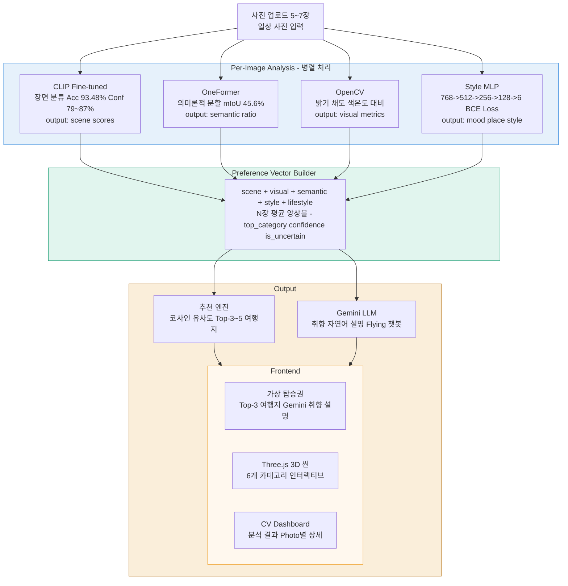
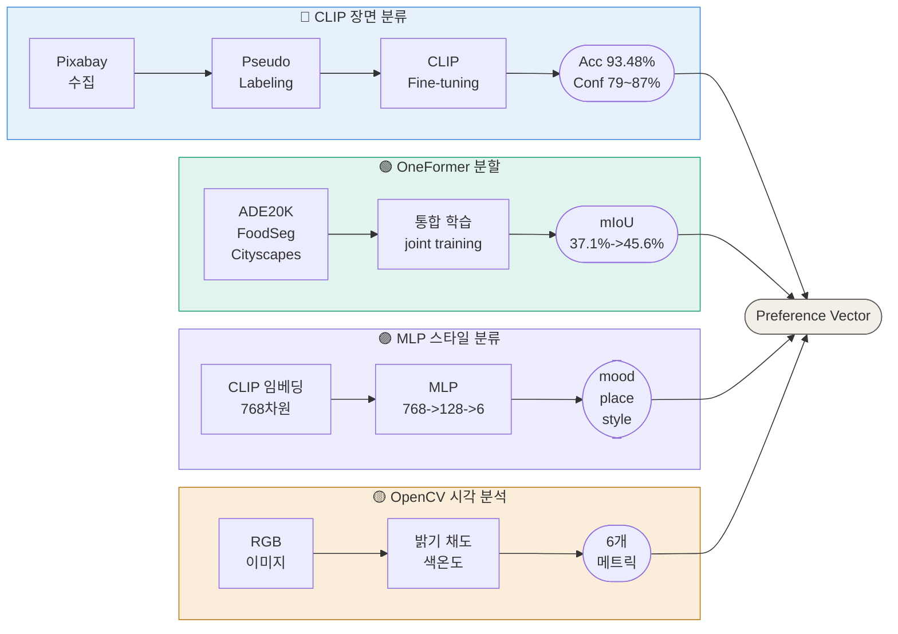

# 📸PhotoTrip

**개인 사진으로 여행 취향을 분석하는 AI 시스템**

---

## Abstract

기존 여행 추천 시스템은 설문·클릭 로그·예약 이력 등 명시적 신호에 의존하며, 사용자가 인지하지 못하는 잠재적 취향—일상 사진에 암묵적으로 내재된 장소 감성, 색감 선호, 분위기 취향—을 반영하기 어렵다는 근본적 한계를 지닌다.

본 연구는 사용자의 일상 사진(5~7장)으로부터 여행 취향을 자동으로 정량화하고 맞춤형 여행지를 추천하는 end-to-end AI 시스템 PhotoTrip을 제안한다.

시스템은 네 개의 분석 모듈을 병렬로 구동한다. (1) 장면 분류: CLIP ViT-B/32를 beach·nature·city·culture·festival·food 6-class로 fine-tuning하여 장면 범주와 예측 confidence를 추출한다. (2) 의미론적 분할: OneFormer의 task-conditioned joint training으로 ADE20K·FoodSeg103·Cityscapes를 단일 모델에서 통합 학습하여 픽셀 수준의 water·sky·vegetation·building·food 비율을 산출한다. (3) 시각 특성 분석: OpenCV로 밝기·채도·대비·색온도를 정량화한다. (4) 스타일 분류: BCE Loss with class weights와 Pseudo Labeling을 적용한 MLP로 분위기·라이프스타일 벡터를 생성한다.

네 모듈의 출력을 통합한 Preference Vector는 코사인 유사도 기반 추천 엔진에 입력되어 Top-3 여행지를 선정하고, Gemini LLM이 결과를 자연어로 설명한다.

실험 결과, 장면 분류에서 CLIP zero-shot 64.27% 대비 fine-tuned 모델이 93.48%(+29.2%p)를 달성하였다. 모델 선택 과정에서 SigLIP fine-tuned는 accuracy(93.56%)가 유사하나 inference confidence가 33%에서 37%에 머무는 반면, CLIP fine-tuned는 79%에서 87% confidence를 일관되게 산출하여 downstream preference vector 품질 관점에서 CLIP을 최종 채택하였다. OneFormer fine-tuning을 통해 mIoU 37.1% → 45.6%로 향상(+8.5%p)을 확보하였다.

3D 씬 렌더링 실험에서는 COLMAP Structure-from-Motion과 3D Gaussian Splatting(3DGS) 파이프라인을 직접 구축하여 2개 씬 학습 및 렌더링 결과를 확보하였으며, 웹 통합 호환성을 고려하여 Three.js procedural rendering으로 최종 전환하였다.

분석 결과는 카테고리별 Three.js 3D 씬, CV 대시보드, 가상 탑승권 UI를 통해 시각화되며, 정량 분석과 Gemini 기반 정성적 해석을 함께 제공하는 설명 가능한 추천 경험을 구현한다.

---

## System Overview



### 카테고리별 분석 예시

| 입력 사진 특성 | 분류 결과 | 추천 여행지 예시 |
|--------------|---------|----------------|
| 해변, 바다, 모래 | 🏖️ beach | 발리, 몰디브, 제주 |
| 산, 숲, 자연 | 🌲 nature | 퀸스타운, 파타고니아, 설악산 |
| 도시, 야경, 빌딩 | 🌆 city | 도쿄, 홍콩, 파리 |
| 사원, 박물관, 문화유산 | 🏛️ culture | 교토, 로마, 이스탄불 |
| 공연, 축제, 음악 | 🎪 festival | 밀라노, 에든버러, 라스베가스 |
| 음식, 카페, 길거리 음식 | 🍜 food | 나폴리, 방콕, 오사카 |

## 🛠️ 기술 스택


| 계층 | 기술 |
|------|------|
| Backend | FastAPI · PyTorch · HuggingFace Transformers |
| 장면 분류 | CLIP ViT-B/32 fine-tuned |
| 의미론적 분할 | OneFormer (swin_large) |
| 시각 분석 | OpenCV |
| 스타일 분류 | MLP · BCE Loss · Pseudo Labeling |
| LLM | Google Gemini API |
| Frontend | Three.js · HTML/CSS/JS |
| 학습 환경 | Google Colab · Kaggle (GPU) |

---

## 💡 Key Contributions

1. **멀티모달 Preference Vector 설계 및 앙상블**
   장면 분류(CLIP) · 의미론적 분할(OneFormer) · 
   시각 특성(OpenCV) · 스타일 분류(MLP) 4개 이질적 모듈의
   출력을 단일 Preference Vector로 통합하는 구조를 직접 설계.
   scene(6차원) · visual(6차원) · semantic(5차원) · 
   style · lifestyle 을 하나의 벡터로 표현하며,
   5~7장 업로드 시 per-image 벡터를 평균 앙상블하여
   단일 사진의 노이즈에 robust한 취향 표현을 구축.
   최종적으로 코사인 유사도 기반 추천 엔진에 입력되어
   Top-3 여행지를 선정하는 end-to-end 파이프라인 완성.
   
2. **Accuracy–Confidence 트레이드오프 실험 설계**
   SigLIP(google/siglip-large-patch16-256)과 
   CLIP(openai/clip-vit-base-patch32)을 동일 데이터셋에서 
   fine-tuning 후 val accuracy와 inference confidence를 직접 비교.
   SigLIP은 val accuracy 93.56%에도 불구하고 
   실제 inference confidence가 33%에서 37%에 머물러
   Preference Vector 품질을 저하시킴을 확인.
   CLIP fine-tuned는 93.48% accuracy와 함께 
   79%에서 87% confidence를 달성하여 최종 채택.
   추가로 Pseudo Labeling · large 데이터 · festival 카테고리 추가 등
   총 5가지 실험 변형을 직접 설계 및 수행.

3. **OneFormer 멀티데이터셋 학습 파이프라인 설계**
   카테고리별 이질적 도메인 데이터셋(ADE20K · FoodSeg103 · Cityscapes)을
   단일 모델로 통합 학습하기 위해 Mask2Former 대신 OneFormer를
   직접 선택·적용하였으며, 멀티데이터셋 학습 파이프라인을 구축.
   Travel-class mIoU 37.1% → 45.6%(+8.5%p) 달성.

4. **Pseudo Labeling 데이터 파이프라인 구축**
   Pixabay API 수집 → SigLIP 자동 라벨링 →
   confidence 필터링 전 과정을 직접 설계 및 구현.

5. **MLP 스타일 분류 모델 설계 및 실험**
   BCE Loss + class weights로 클래스 불균형을 처리하고,
   mood · place · style 3개 MLP를 독립적으로 설계.
   다수의 학습 실험을 통해 최적 모델 선정.
   CLIP 임베딩(768차원) → 6-class multilabel 분류.

6. **COLMAP + 3DGS 렌더링 파이프라인 구축 실험**
   Structure-from-Motion(COLMAP) 기반 포인트 클라우드 생성부터
   3D Gaussian Splatting 학습까지 직접 실험하여
   2개 씬 렌더링 결과 확보.
   웹 서비스 호환성 한계로 Three.js로 전환.

---

## 배경 및 관련 연구

### Semantic Segmentation 발전

| 연도 | 모델 | 주요 기여 |
|------|------|----------|
| 2015 | FCN | 최초 end-to-end 픽셀 단위 분류 |
| 2017 | DeepLab v3 | Atrous convolution, multi-scale context 도입 |
| 2022 | Mask2Former | Universal segmentation 시도; 단, 태스크마다 개별 학습 필요 |
| 2023 | OneFormer | Task-conditioned joint training으로 단일 학습만으로 멀티 태스크/데이터셋 통합 가능 |

### OneFormer 채택 배경

본 프로젝트는 6개 여행 카테고리별로 서로 다른 도메인의 데이터셋을 사용한다.

| 카테고리 | 학습 데이터셋 | 도메인 |
|---------|------------|--------|
| 자연/도시/문화 | ADE20K | 실내외 범용 장면 |
| 음식 | FoodSeg103 | 음식 특화 |
| 도시/도로 | Cityscapes | 도시 주행 장면 |

Mask2Former를 사용할 경우 데이터셋마다 별도 모델 학습이 필요하여 최소 3개 모델, 3배의 GPU 메모리·학습 시간이 요구된다. OneFormer의 task-conditioned joint training은 단일 모델로 3개 데이터셋을 통합 학습할 수 있어 채택하였으며, 실험 결과 Travel-class mIoU가 37.1% -> 45.6%로 향상되었다 (Jain et al., CVPR 2023).

### Vision-Language Models

| Model | Method | Val Accuracy | Inference Confidence |
|-------|--------|-------------|---------------------|
| SigLIP (Zhai et al., 2023) | Sigmoid loss | 93.56% | 33~37% ❌ |
| **CLIP (Radford et al., 2021)** | **Contrastive learning** | **93.48%** | **79~87% ✅** |

SigLIP은 각 클래스를 독립적으로 평가하는 sigmoid loss 특성상 inference confidence가 33~37%에 머물러 Preference Vector 품질을 저하시킨다. CLIP의 softmax 기반 confidence(79~87%)가 취향 신호를 명확하게 전달하여 최종 채택.

> For detailed experiments, see **Experiments & Results** section.

---

## 모델 학습 구조



---

## Experiments & Results

### 1. Scene Classification

6-class travel scene classification (beach, nature, city, culture, festival, food)

| Model | Val Accuracy | Notes |
|-------|-------------|-------|
| CLIP Zero-shot | 64.27% | Prompt-based, no fine-tuning |
| SigLIP baseline | 90.91% | google/siglip-large-patch16-256 |
| SigLIP + large data | 90.52% | Slight drop with more data |
| SigLIP + festival class | 93.56% | Added festival category |
| SigLIP + Pseudo Labeling | 93.14% | Semi-supervised approach |
| **CLIP Fine-tuned** | **93.48%** | **openai/clip-vit-base-patch32 ✅** |

> **CLIP 채택 근거:** accuracy parity 조건 하에서
> SigLIP(33~37%) 대비 CLIP(79~87%)의 월등한
> inference confidence가 Preference Vector 품질에 직결됨.

<p align="center">
  
</p>
<p align="center">
  
  
</p>

---

### 2. Semantic Segmentation

| Model | mIoU | Training Data | Notes |
|-------|------|--------------|-------|
| OneFormer pretrained | 37.1% | ADE20K | Baseline |
| **OneFormer fine-tuned** | **45.6%** | ADE20K + FoodSeg103 + Cityscapes | **Final model ✅** |

- **Model**: `shi-labs/oneformer_ade20k_swin_large`
- **Purpose**: Extract travel-relevant semantic ratios (water, sky, vegetation, building, food) from ADE20K class predictions
- **Training Strategy**: Task-conditioned joint training across 3 heterogeneous datasets in a single model
- **Result**: Travel-class mIoU improved from 37.1% to 45.6% (+8.5%p)

> **OneFormer 채택 근거:** 카테고리별 이질적 도메인 데이터셋을
> 단일 모델로 통합 학습하기 위해 Mask2Former 대신 채택.
> → 자세한 배경은 Related Work 참고.

<p align="center">
  
</p>
<p align="center">
  
</p>

---

### 3. Preference Vector 학습 (MLP)

| 항목 | 설정 |
|------|------|
| 입력 | CLIP image embedding (768-dim) |
| 구조 | MLP 768→512→256→128→6, multilabel sigmoid |
| Loss | BCE Loss with class weights (희소 클래스 보정) |
| 데이터 | Pseudo Labeling pipeline (v3 generator) |
| Sampler | Rare-class weighted sampler |
| Val F1 (macro) | [TBD] |
| Val F1 (micro) | [TBD] |

---

### 4. 3D 씬 렌더링

| 단계 | 내용 |
|------|------|
| 초기 시도 | COLMAP + 3D Gaussian Splatting (3DGS) 파이프라인 |
| 결과 | 2개 씬 학습 완료, 오프라인 렌더링 결과 확보 |
| 전환 사유 | 웹 브라우저 통합 시 호환성·로딩 시간·GPU 의존성 문제 |
| 최종 구현 | Three.js procedural scene (beach, nature, city, culture, food, festival) |
| 정량 평가 | [TBD] |

---

### 5. 종합 결과

| 항목 | 수치 / 상태 |
|------|------------|
| Scene Classification (CLIP FT) | Val Acc **93.48%** · Confidence **79~87%** |
| Segmentation (OneFormer FT) | mIoU **45.6%** (+8.5%p vs pretrained) |
| MLP (mood / place / style) | Val F1 [TBD] |
| Multi-image Ensemble | 5~7장 per-image vector 평균 앙상블 |
| Recommendation | Top-3~5 destinations, category-aware scoring |
| End-to-end Latency | [TBD] s / 7 images (GPU) |

---

## Limitations & Future Work

**주요 전환 결정 요약**

| 결정 | 초기 시도 | 최종 선택 | 이유 |
|------|---------|---------|------|
| 장면 분류 | SigLIP fine-tuned | **CLIP fine-tuned** | inference confidence 33~37% vs 79~87%; preference vector 품질에 직결 |
| Segmentation | Mask2Former | **OneFormer** | 멀티 데이터셋 통합 학습 효율; Mask2Former는 태스크별 개별 학습 필요 |
| 3D 렌더링 | COLMAP + 3DGS | **Three.js** | 웹 통합 호환성, 실시간 렌더링, GPU 의존성 제거 |

1. **Confidence over Raw Accuracy**  
   SigLIP은 validation accuracy가 높으나 inference confidence가 낮아 production 배포에 부적합하다고 판단, CLIP fine-tuned를 채택하였다.

2. **Mask2Former → OneFormer**  
   카테고리별로 서로 다른 도메인의 데이터셋(ADE20K, FoodSeg103 등)을 통합 학습할 때, Mask2Former는 태스크마다 개별 학습이 필요하여 학습 비용이 과도하게 증가한다. OneFormer의 task-conditioned joint training이 멀티 데이터셋 통합에 구조적으로 적합하다.

3. **3DGS → Three.js**  
   3DGS는 photorealistic novel-view synthesis에 유리하나, 웹 배포·실시간 상호작용·모바일 호환성 측면에서 Three.js procedural rendering이 더 적합하였다.

4. **Gemini API 의존**  
   자연어 설명 및 챗봇은 외부 LLM API에 의존하며, API 키(`GOOGLE_API_KEY`) 및 네트워크 연결이 필요하다.

5. **카테고리 한계**  
   6-class scene taxonomy는 여행 도메인을 coarse-grained로만 표현한다. 세부 테마(예: hiking vs. beach resort) 구분은 추가 확장이 필요하다.

6. **Cold-start**  
   업로드 사진 수(최소 5장) 및 품질에 따라 `is_uncertain` 플래그가 활성화되며, 이 경우 랜덤/보조 추천 fallback이 동작한다.

### 향후 개선 방향
- 실제 여행지 드론 영상으로 3DGS 재학습 및 웹 통합
- 6개 카테고리를 세분화된 하위 테마로 확장
  (예: beach -> 리조트형 vs 자연형)
- MLP v3/v4 F1 수치 기반 최적 버전 확정
- 사용자 피드백 기반 추천 개선 루프 구축
- 모바일 앱 확장

---

## Installation & Usage

### 요구 사항

- Python 3.10+
- CUDA-capable GPU (권장)
- Node.js 불필요 (정적 frontend, Three.js CDN)

### 설치

```bash
git clone <repository-url>
cd cv_project

python -m venv venv
# Windows
venv\Scripts\activate
# Linux / macOS
source venv/bin/activate

pip install -r requirements.txt
```

### 환경 변수

프로젝트 루트에 `.env` 파일을 생성한다.

```env
GOOGLE_API_KEY=your_gemini_api_key
```

### 모델 가중치

Fine-tuned CLIP 가중치를 `models/best_clip.pth`에 배치한다.  
(경로는 `backend/siglip_classifier.py`의 `DEFAULT_MODEL_PATH` 참조)

```
models/
  best_clip.pth          # CLIP fine-tuned (최종 분류 모델)
  best_siglip.pth        # SigLIP fine-tuned (실험용)
  mlp_mood_best.pth
  mlp_place_best.pth
  mlp_style_best.pth
  oneformer_top/         # OneFormer fine-tuned 체크포인트
```

### 서버 실행

```bash
uvicorn backend.main:app --reload --port 8000
```

브라우저에서 `http://localhost:8000` 접속.

### 사용 흐름

1. 메인 화면에서 **바코드(탑승권)** 클릭 → 업로드 화면 이동
2. 일상 사진 **5~7장** 업로드
3. **AI 분석 시작** → 로딩 → 결과 화면
4. 좌측: 3D 씬 + CV Analysis (미니 카드, 전체/Photo별 분석)
5. 우측: Gemini 요약, CV 상세 분석, Flying 챗봇, 탑승권 발급

### Fine-tuning (선택)

```bash
# CLIP 장면 분류 fine-tuning
python classification/clip_finetune.py \
    --train_dir data/train \
    --val_dir data/val \
    --epochs 10 --batch_size 32 --lr 1e-5

# SigLIP (실험용)
python classification/siglip_finetune.py \
    --train_dir data/train \
    --val_dir data/val \
    --epochs 10
```

---

## References

1. Radford, A., Kim, J. W., Hallacy, C., Ramesh, A., Goh, G., Agarwal, S., ... & Sutskever, I. (2021). *Learning Transferable Visual Models From Natural Language Supervision.* ICML. (CLIP)
2. Zhai, X., Mustafa, B., Kolesnikov, A., & Beyer, L. (2023). *Sigmoid Loss for Language Image Pre-Training.* ICCV. (SigLIP)
3. Jain, J., Li, J., Chiu, M. T., Hassani, A., Orlov, N., & Shi, H. (2023). *OneFormer: One Transformer to Rule Universal Image Segmentation.* CVPR.
4. Cheng, B., Misra, I., Schwing, A. G., Kirillov, A., & Girdhar, R. (2022). *Masked-attention Mask Transformer for Universal Image Segmentation (Mask2Former).* CVPR.
5. Kerbl, B., Kopanas, G., Leimkühler, T., & Drettakis, G. (2023). *3D Gaussian Splatting for Real-Time Radiance Field Rendering.* ACM Transactions on Graphics (SIGGRAPH).
6. Schönberger, J. L., & Frahm, J.-M. (2016). *Structure-from-Motion Revisited.* CVPR. (COLMAP)
7. Google DeepMind. *Gemini API Documentation.* https://ai.google.dev/

---

*PhotoTrip — Computer Vision Course Project*
