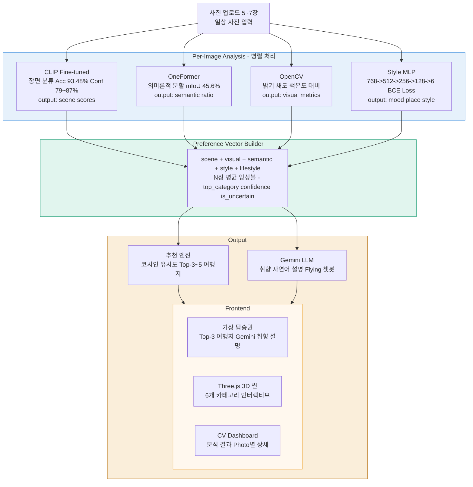

# 📸 PhotoTrip

### **개인 사진으로 여행 취향을 분석하는 AI 시스템**

<sub><span style="color: gray;">CLIP · OneFormer · OpenCV · MLP 4개 CV 모듈을 병렬로 구동하여 일상 사진 5~7장에서 장면 감성, 색감 선호, 공간 구성을 자동 분석하고 Preference Vector로 정량화한 뒤, 코사인 유사도 기반 추천 엔진으로 맞춤 여행지를 선정한다. Gemini LLM이 분석 결과를 자연어로 설명하고, Three.js 3D 씬과 가상 탑승권 UI로 시각화하여 "내 사진이 보여주는 나의 여행지"를 직관적으로 전달한다.</span></sub>
---
## 📋 Table of Contents
- [Abstract](#abstract)
- [Demo](#-demo)
- [System Overview](#system-overview)
- [Tech Stack](#️-tech-stack)
- [Key Contributions](#-key-contributions)
- [Related Work](#-related-work)
- [Model Architecture](#-model-architecture)
- [Experiments & Results](#experiments--results)
- [Limitations & Future Work](#limitations--future-work)
- [Installation & Usage](#-installation--usage)
- [References](#references)

---

## Abstract

기존 여행 추천 시스템은 설문·클릭 로그·예약 이력 등 명시적 신호에 의존하며, 사용자가 인지하지 못하는 잠재적 취향—일상 사진에 암묵적으로 내재된 장소 감성, 색감 선호, 분위기 취향—을 반영하기 어렵다는 근본적 한계를 지닌다.

본 연구는 사용자의 일상 사진(5~7장)으로부터 여행 취향을 자동으로 정량화하고 맞춤형 여행지를 추천하는 end-to-end AI 시스템 PhotoTrip을 제안한다.

시스템은 네 개의 분석 모듈을 병렬로 구동한다. (1) 장면 분류: CLIP ViT-B/32를 beach·nature·city·culture·festival·food 6-class로 fine-tuning하여 장면 범주와 예측 confidence를 추출한다. (2) 의미론적 분할: OneFormer의 task-conditioned joint training으로 ADE20K·FoodSeg103·Cityscapes를 단일 모델에서 통합 학습하여 픽셀 수준의 water·sky·vegetation·building·food 비율을 산출한다. (3) 시각 특성 분석: OpenCV로 밝기·채도·대비·색온도를 정량화한다. (4) 스타일 분류: BCE Loss with class weights와 Pseudo Labeling을 적용한 MLP로 분위기·라이프스타일 벡터를 생성한다.

네 모듈의 출력을 통합한 Preference Vector는 코사인 유사도 기반 추천 엔진에 입력되어 Top-3 여행지를 선정하고, Gemini LLM이 결과를 자연어로 설명한다.

실험 결과, 장면 분류에서 CLIP zero-shot 64.27% 대비 fine-tuned 모델이 93.48%(+29.2%p)를 달성하였다. 모델 선택 과정에서 SigLIP fine-tuned는 accuracy(93.56%)가 유사하나 inference confidence가 33%에서 37%에 머무는 반면, CLIP fine-tuned는 79%에서 87% confidence를 일관되게 산출하여 downstream preference vector 품질 관점에서 CLIP을 최종 채택하였다. OneFormer fine-tuning을 통해 mIoU 37.1% → 45.6%로 향상(+8.5%p)을 확보하였다.

3D 씬 렌더링 실험에서는 COLMAP Structure-from-Motion과 3D Gaussian Splatting(3DGS) 파이프라인을 직접 구축하여 2개 씬 학습 및 렌더링 결과를 확보하였으며, 웹 통합 호환성을 고려하여 Three.js procedural rendering으로 최종 전환하였다.

분석 결과는 카테고리별 Three.js 3D 씬, CV 대시보드, 가상 탑승권 UI를 통해 시각화되며, 정량 분석과 Gemini 기반 정성적 해석을 함께 제공하는 설명 가능한 추천 경험을 구현한다.

---

## System Overview



### 카테고리별 분석 예시

| 입력 사진 특성 | 분류 결과 | 추천 여행지 예시 |
|--------------|---------|----------------|
| 해변, 바다, 모래 | 🏖️ beach | 발리, 몰디브, 제주 |
| 산, 숲, 자연 | 🌲 nature | 퀸스타운, 파타고니아, 설악산 |
| 도시, 야경, 빌딩 | 🌆 city | 도쿄, 홍콩, 파리 |
| 사원, 박물관, 문화유산 | 🏛️ culture | 교토, 로마, 이스탄불 |
| 공연, 축제, 음악 | 🎪 festival | 밀라노, 에든버러, 라스베가스 |
| 음식, 카페, 길거리 음식 | 🍜 food | 나폴리, 방콕, 오사카 |

## 🛠️ Tech Stack


| 계층 | 기술 |
|------|------|
| Backend | FastAPI · PyTorch · HuggingFace Transformers |
| 장면 분류 | CLIP ViT-B/32 fine-tuned |
| 의미론적 분할 | OneFormer (swin_large) |
| 시각 분석 | OpenCV |
| 스타일 분류 | MLP · BCE Loss · Pseudo Labeling |
| LLM | Google Gemini API |
| Frontend | Three.js · HTML/CSS/JS |
| 학습 환경 | Google Colab · Kaggle (GPU) |

---

## 💡 Key Contributions

1. **멀티모달 Preference Vector 설계 및 앙상블**
   장면 분류(CLIP) · 의미론적 분할(OneFormer) ·
   시각 특성(OpenCV) · 스타일 분류(MLP) 4개 이질적 모듈의
   출력을 단일 Preference Vector로 통합하는 구조를 직접 설계.
   scene(6차원) · visual(6차원) · semantic(5차원) ·
   style · lifestyle 을 하나의 벡터로 표현하며,
   5~7장 업로드 시 per-image 벡터를 평균 앙상블하여
   단일 사진의 노이즈에 robust한 취향 표현을 구축.

   특히 OpenCV 색감 분석(밝기·채도·색온도·대비)과
   Style MLP 출력을 사전 정의된 여행지 프로필의
   시각적 특성과 코사인 유사도로 매칭함으로써,
   CV 분석 결과가 직접 여행지 추천에 반영되는
   end-to-end 파이프라인을 구현하였다.
   (예: 따뜻한 색감 + vibrant 스타일 → 발리·방콕 추천)

   최종적으로 코사인 유사도 기반 추천 엔진에 입력되어
   Top-3 여행지를 선정하는 end-to-end 파이프라인 완성.
   
2. **Accuracy–Confidence 트레이드오프 실험 설계**
   SigLIP(google/siglip-large-patch16-256)과 
   CLIP(openai/clip-vit-base-patch32)을 동일 데이터셋에서 
   fine-tuning 후 val accuracy와 inference confidence를 직접 비교.
   SigLIP은 val accuracy 93.56%에도 불구하고 
   실제 inference confidence가 33%에서 37%에 머물러
   Preference Vector 품질을 저하시킴을 확인.
   CLIP fine-tuned는 93.48% accuracy와 함께 
   79%에서 87% confidence를 달성하여 최종 채택.
   추가로 Pseudo Labeling · large 데이터 · festival 카테고리 추가 등
   총 5가지 실험 변형을 직접 설계 및 수행.

3. **OneFormer 멀티데이터셋 학습 파이프라인 설계**
   카테고리별 이질적 도메인 데이터셋(ADE20K · FoodSeg103 · Cityscapes)을
   단일 모델로 통합 학습하기 위해 Mask2Former 대신 OneFormer를
   직접 선택·적용하였으며, 멀티데이터셋 학습 파이프라인을 구축.
   Travel-class mIoU 37.1% → 45.6%(+8.5%p) 달성.

4. **Pseudo Labeling 데이터 파이프라인 구축**
   Pixabay API 수집 → SigLIP 자동 라벨링 →
   confidence 필터링 전 과정을 직접 설계 및 구현.

5. **MLP 스타일 분류 모델 설계 및 실험**
   BCE Loss + class weights로 클래스 불균형을 처리하고,
   mood · place · style 3개 MLP를 독립적으로 설계.
   다수의 학습 실험을 통해 최적 모델 선정.
   CLIP 임베딩(768차원) → 6-class multilabel 분류.

6. **COLMAP + 3DGS 렌더링 파이프라인 구축 실험**
   Structure-from-Motion(COLMAP) 기반 포인트 클라우드 생성부터
   3D Gaussian Splatting 학습까지 직접 실험하여
   2개 씬 렌더링 결과 확보.
   웹 서비스 호환성 한계로 Three.js로 전환.

---

## 📚 Related Work

### Semantic Segmentation 발전

| 연도 | 모델 | 주요 기여 |
|------|------|----------|
| 2015 | FCN | 최초 end-to-end 픽셀 단위 분류 |
| 2017 | DeepLab v3 | Atrous convolution, multi-scale context 도입 |
| 2022 | Mask2Former | Universal segmentation 시도; 단, 태스크마다 개별 학습 필요 |
| 2023 | OneFormer | Task-conditioned joint training으로 단일 학습만으로 멀티 태스크/데이터셋 통합 가능 |

### OneFormer 채택 배경

본 프로젝트는 6개 여행 카테고리별로 서로 다른 도메인의 데이터셋을 사용한다.

| 카테고리 | 학습 데이터셋 | 도메인 |
|---------|------------|--------|
| 자연/도시/문화 | ADE20K | 실내외 범용 장면 |
| 음식 | FoodSeg103 | 음식 특화 |
| 도시/도로 | Cityscapes | 도시 주행 장면 |

Mask2Former를 사용할 경우 데이터셋마다 별도 모델 학습이 필요하여 최소 3개 모델, 3배의 GPU 메모리·학습 시간이 요구된다. OneFormer의 task-conditioned joint training은 단일 모델로 3개 데이터셋을 통합 학습할 수 있어 채택하였으며, 실험 결과 Travel-class mIoU가 37.1% -> 45.6%로 향상되었다 (Jain et al., CVPR 2023).

### Vision-Language Models

| Model | Method | Val Accuracy | Inference Confidence |
|-------|--------|-------------|---------------------|
| SigLIP (Zhai et al., 2023) | Sigmoid loss | 93.56% | 33~37% ❌ |
| **CLIP (Radford et al., 2021)** | **Contrastive learning** | **93.48%** | **79~87% ✅** |

SigLIP은 각 클래스를 독립적으로 평가하는 sigmoid loss 특성상 inference confidence가 33~37%에 머물러 Preference Vector 품질을 저하시킨다. CLIP의 softmax 기반 confidence(79~87%)가 취향 신호를 명확하게 전달하여 최종 채택.

> 자세한 실험 결과는 Experiments & Results 섹션 참고.

---

## 🧠 Model Architecture


---

## Experiments & Results

### 1. 장면 분류 (Scene Classification)

6-class 여행 장면 분류 (beach, nature, city, culture, festival, food)

| 모델 | Val Accuracy | 비고 |
|------|-------------|------|
| CLIP Zero-shot | 64.27% | 프롬프트 기반, fine-tuning 없음 |
| SigLIP 기본 | 90.91% | google/siglip-large-patch16-256 |
| SigLIP + large 데이터 | 90.52% | 데이터 규모 확대 시 소폭 하락 |
| SigLIP + festival 카테고리 | 93.56% | festival 클래스 추가 |
| SigLIP + Pseudo Labeling | 93.14% | pseudo label 기반 semi-supervised |
| **CLIP Fine-tuned** | **93.48%** | **openai/clip-vit-base-patch32 ✅** |

> **CLIP 채택 근거**: accuracy parity 조건 하에서
> SigLIP(33%에서37%) 대비 CLIP(79%에서87%)의 월등한
> inference confidence가 Preference Vector 품질에 직결됨.

<p align="center">
  
</p>
<p align="center">
  
  
</p>

---

### 2. 의미론적 분할 (Semantic Segmentation)

| 모델 | mIoU | 학습 데이터 | 비고 |
|------|------|-----------|------|
| OneFormer pretrained | 37.1% | ADE20K | 기준선 |
| **OneFormer fine-tuned** | **45.6%** | ADE20K + FoodSeg103 + Cityscapes | **최종 채택 ✅** |

- **모델**: `shi-labs/oneformer_ade20k_swin_large`
- **목적**: ADE20K 클래스를 travel-relevant semantic ratio (water, sky, vegetation, building, food)로 집계
- **학습 전략**: 3개 이질적 도메인 데이터셋을 task-conditioned joint training으로 단일 모델 통합 학습
- **결과**: Travel-class mIoU 37.1% → 45.6% (+8.5%p) 향상

> **OneFormer 채택 근거**: 카테고리별 이질적 도메인 데이터셋을
> 단일 모델로 통합 학습하기 위해 Mask2Former 대신 채택.
> 자세한 배경은 Related Work 참고.

<p align="center">
  
</p>
<p align="center">
  
</p>

---

### 3. Preference Vector 학습 (MLP)

| 항목 | 설정 |
|------|------|
| 입력 | CLIP image embedding (768-dim) |
| 구조 | MLP 768→512→256→128→6, multilabel sigmoid |
| 손실 함수 | BCE Loss with class weights (희소 클래스 보정) |
| 데이터 | Pseudo Labeling pipeline (v3 generator) |
| 샘플러 | Rare-class weighted sampler |
| 검증 F1 (macro) | [TBD] |
| 검증 F1 (micro) | [TBD] |

---

### 4. 3D 장면 렌더링 실험 (3D Scene Rendering Experiment)

| 단계 | 내용 |
|------|------|
| 파이프라인 | COLMAP Structure-from-Motion + 3D Gaussian Splatting |
| 결과 | 2개 씬 학습 완료 및 렌더링 결과 확보 |
| 한계 | 웹 브라우저 실시간 렌더링 불가, GPU 의존성 |
| 최종 선택 | Three.js procedural rendering |
| 전환 이유 | 웹 호환성, 실시간 렌더링, GPU 의존성 제거 |

제한된 학습 이미지(20~30장) 환경에서 주요 객체의 3D 구조 재구성에 성공하였으나, 배경 영역 아티팩트 발생. 웹 실시간 서비스 통합의 현실적 한계로 Three.js 전환.

<p align="center">
  
  
</p>
<p align="center"><em>3DGS 렌더링 결과 — 야자수 씬(좌), 오브젝트 씬(우)</em></p>

---

### 5. 종합 결과

| 모듈 | 모델 | 성능 |
|------|------|------|
| 장면 분류 | CLIP ViT-B/32 fine-tuned | Val Acc 93.48% · Confidence 79~87% |
| 의미론적 분할 | OneFormer swin-large | Travel-class mIoU 45.6% (+8.5%p) |
| 스타일 분류 | MLP (768→512→256→128→6) | BCE Loss + class weights 적용 |
| 시각 특성 | OpenCV | 밝기·채도·색온도·대비 6개 메트릭 |
| 추천 엔진 | 코사인 유사도 | Top-3~5 여행지 선정 |
| 앙상블 | per-image 평균 | 5~7장 입력 기준 |

---

## Limitations & Future Work

### Current Limitations

1. **여행 취향의 coarse-grained 표현**
   본 시스템은 데이터 수집 가능성과 모델 학습 복잡도를
   고려하여 의도적으로 6개 카테고리로 taxonomy를 설계하였다.
   그러나 실제 사용자 취향은 카테고리 간 경계가 모호하며
   세부 테마(예: 리조트형 vs 자연형 beach) 구분이 어렵다.
   향후 계층적 분류 체계로 확장 가능하다.

2. **멀티 도메인 통합 평가 기준 부재**
   ADE20K · FoodSeg103 · Cityscapes를 통합 학습한 모델의
   정량 평가를 위한 단일 통합 벤치마크가 존재하지 않는다.
   도메인별 개별 평가는 멀티 도메인 학습 성능을
   완전히 반영하지 못하며, 이는 멀티 도메인 학습 연구의
   공통적인 평가 기준 수립 과제이다.

3. **Pseudo Labeling 노이즈**
   Pixabay API 기반 자동 수집 데이터는
   confidence threshold 필터링에도 불구하고
   도메인 편향 및 라벨 노이즈가 잔존할 수 있다.
   Human-annotated 데이터와의 혼합 학습으로 개선 가능하다.

4. **3DGS 웹 서비스 통합 한계**
   COLMAP + 3DGS 파이프라인을 직접 구축하고
   2개 씬 학습 및 렌더링 결과를 확보하였으나,
   두 가지 한계를 확인하였다.
   첫째, 제한된 학습 이미지(20~30장) 환경에서
   배경 영역 아티팩트가 발생하여 목표한 수준의
   photorealistic 렌더링 품질을 달성하지 못하였다.
   충분한 멀티뷰 이미지(100장+)와 추가 학습으로 개선 가능하다.
   둘째, 웹 브라우저 실시간 렌더링 불가, GPU 의존성,
   대용량 모델 로딩 시간 등 현재 웹 서비스 환경의
   기술적 제약으로 직접 통합이 어렵다고 판단하였다.
   WebGL 기반 3DGS 뷰어(예: gsplat.js) 기술 성숙 시
   재통합 가능하다.

5. **외부 API 의존성**
   Gemini API 기반 자연어 설명은 외부 서비스 의존으로
   API 장애 시 서비스 품질이 저하된다.
   경량 온디바이스 LLM으로의 전환을 고려할 수 있다.

6. **스타일 분류의 주관성 한계**
   mood · place · style 분류는 본질적으로 주관적 개념이다.
   Pseudo Labeling 기반 자동 라벨링은 개인마다 다르게
   느끼는 "분위기"와 "스타일"을 단일 기준으로 정의하여
   라벨의 주관성 문제가 잔존한다.
   여행지 프로필은 객관적 시각 특성(색감·밝기·채도)으로
   정의하였으나, 사용자별 스타일 인식 차이를 반영하기 위해
   개인화 피드백 루프 구축이 필요하다.

### Future Work
1. **VR 기반 여행지 프리뷰**
   추천된 여행지를 WebXR API + 3DGS 씬으로
   VR 환경에서 직접 체험 가능하도록 확장.
   실제 여행지 드론 영상 기반 3DGS 학습으로
   몰입형 여행 미리보기 경험 구현.

2. **개인화 스타일 피드백 루프**
   추천 결과에 대한 사용자 피드백을 수집하여
   개인별 색감·분위기 선호를 Preference Vector에
   지속적으로 반영. 스타일 라벨의 주관성 문제를
   개인화로 점진적 해결.

3. **3DGS 품질 개선 및 웹 통합**
   실제 여행지 드론 영상(100장+) 기반 재학습으로
   렌더링 품질 향상. gsplat.js 등 WebGL 기반
   3DGS 뷰어 기술 성숙 시 웹 직접 통합.

4. **계층적 카테고리 확장**
   6개 → 세부 하위 테마로 확장
   (예: beach → 리조트형 / 자연형 / 액티비티형)
   CV 분석 결과와 더 세분화된 여행지 프로필 매칭.

5. **멀티 도메인 평가 기준 수립**
   ADE20K · FoodSeg103 · Cityscapes 통합 학습 모델의
   정량 평가를 위한 travel-specific 평가 기준 수립.

6. **모델 경량화**
   모바일 환경을 위한 경량화
   (CLIP → MobileCLIP, OneFormer → 경량 segmentation)
   모바일에서도 실시간 CV 분석 가능하도록 확장.

---

## 🚀 Installation & Usage

### Requirements

- Python 3.10+
- CUDA-capable GPU (권장)
- Google Gemini API Key

### Installation

```bash
git clone https://github.com/your-username/PhotoTrip.git
cd PhotoTrip

python -m venv venv
# Windows
venv\Scripts\activate
# Linux / macOS
source venv/bin/activate

pip install -r requirements.txt
```

### Environment Variables

프로젝트 루트에 `.env` 파일을 생성한다.

```env
GOOGLE_API_KEY=your_gemini_api_key
```

### Model Weights

아래 모델 파일을 `models/` 디렉터리에 배치한다.
```bash
models/
best_clip.pth              # CLIP fine-tuned (장면 분류)
best_siglip.pth            # SigLIP fine-tuned (실험용)
mlp_mood_best.pth          # MLP mood 분류
mlp_place_best.pth         # MLP place 분류
mlp_style_best.pth         # MLP style 분류
oneformer_top/             # OneFormer fine-tuned
config.json
model.safetensors
processor_config.json
tokenizer.json
tokenizer_config.json
```

### Run Server

```bash
uvicorn backend.main:app --reload --port 8000
```

브라우저에서 `http://localhost:8000` 접속.

### Usage Flow

1. 메인 화면 바코드 클릭 → 업로드 화면 이동
2. 일상 사진 **5~7장** 업로드
3. **AI 분석 시작** 클릭 → 로딩
4. 결과 화면:
   - 좌측: Three.js 3D 씬 + CV Analysis 대시보드
   - 우측: Gemini 취향 설명 + Flying 챗봇 + 가상 탑승권

### Fine-tuning (Optional)

```bash
# CLIP 장면 분류 fine-tuning
python classification/clip_finetune.py \
    --train_dir data/train \
    --val_dir data/val \
    --epochs 10 \
    --batch_size 32 \
    --lr 1e-5

# SigLIP fine-tuning (실험용)
python classification/siglip_finetune.py \
    --train_dir data/train \
    --val_dir data/val \
    --epochs 10

# OneFormer fine-tuning
# Kaggle 환경 권장 (GPU 메모리 24GB+)
```

---

## References

1. Radford, A., Kim, J. W., Hallacy, C., Ramesh, A., Goh, G., Agarwal, S., ... & Sutskever, I. (2021). *Learning Transferable Visual Models From Natural Language Supervision.* ICML. (CLIP)
2. Zhai, X., Mustafa, B., Kolesnikov, A., & Beyer, L. (2023). *Sigmoid Loss for Language Image Pre-Training.* ICCV. (SigLIP)
3. Jain, J., Li, J., Chiu, M. T., Hassani, A., Orlov, N., & Shi, H. (2023). *OneFormer: One Transformer to Rule Universal Image Segmentation.* CVPR.
4. Cheng, B., Misra, I., Schwing, A. G., Kirillov, A., & Girdhar, R. (2022). *Masked-attention Mask Transformer for Universal Image Segmentation (Mask2Former).* CVPR.
5. Kerbl, B., Kopanas, G., Leimkühler, T., & Drettakis, G. (2023). *3D Gaussian Splatting for Real-Time Radiance Field Rendering.* ACM Transactions on Graphics (SIGGRAPH).
6. Schönberger, J. L., & Frahm, J.-M. (2016). *Structure-from-Motion Revisited.* CVPR. (COLMAP)
7. Google DeepMind. *Gemini API Documentation.* https://ai.google.dev/

---

*PhotoTrip — Computer Vision Course Project*
