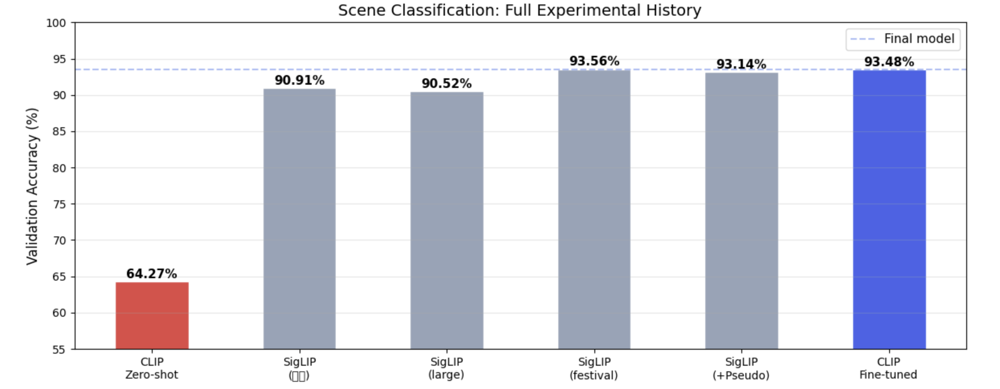
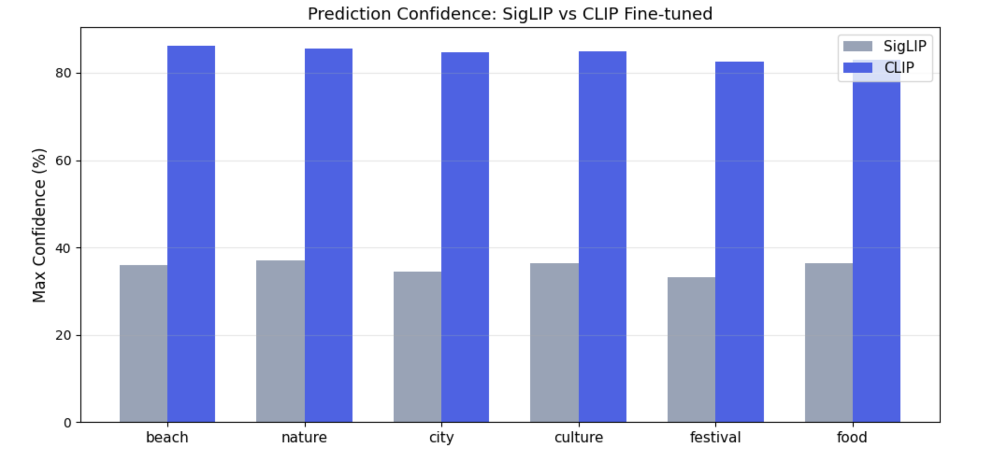
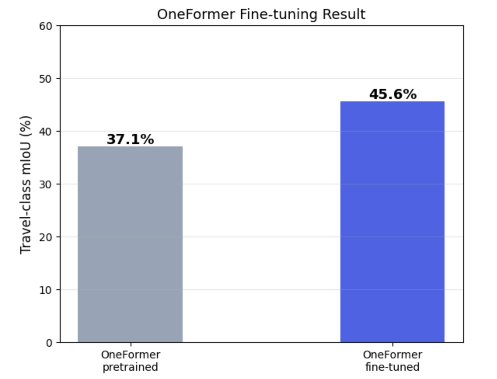
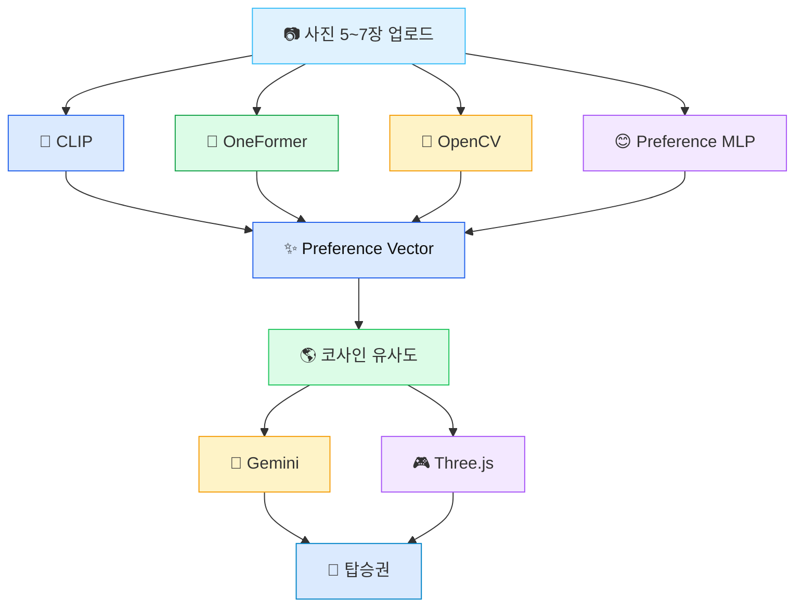
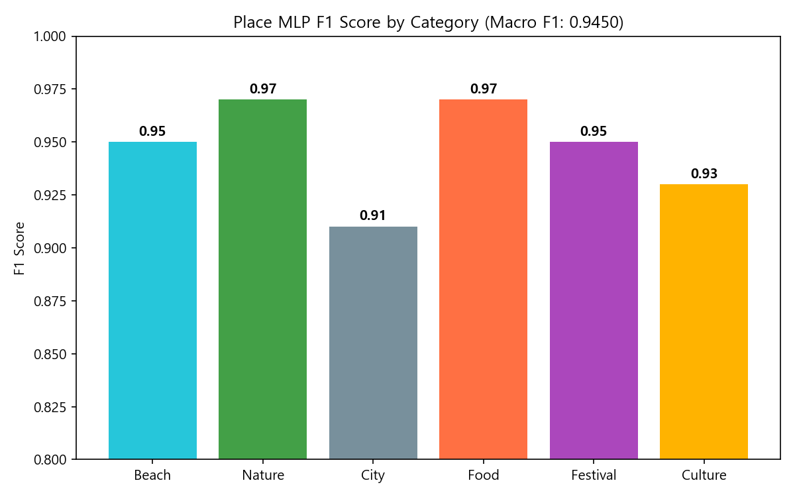
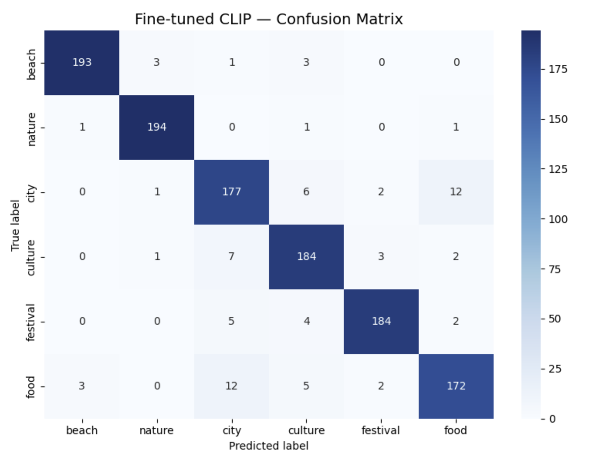
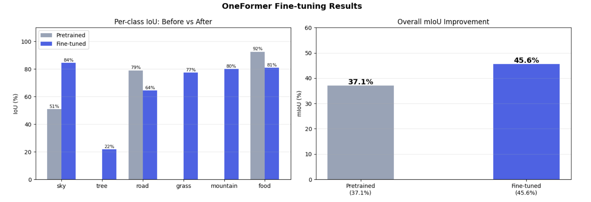

<div align="center">


<br/>

### ✈️ 일상 사진으로 발견하는 나만의 여행 취향

**PhotoTrip은 사용자의 일상 사진 5~7장을 분석하여  
잠재적인 시각 선호를 추론하고, 맞춤 여행지를 추천하는 멀티모달 AI 서비스입니다.**

<br/>


<br/><br/>


<br/><br/>

> ☁️ **PhotoTrip은 오직 일상 사진만으로 여행 취향을 추론합니다.**

</div>

<br/>

---

<br/>

<div align="center">

## 🛫 Boarding Now

<table>
<tr>
<td align="center" width="180">
<h3>📷</h3>
<b>Upload</b>
<br/>
일상 사진 5~7장
</td>
<td align="center" width="60">
<h2>→</h2>
</td>
<td align="center" width="180">
<h3>🧠</h3>
<b>Analyze</b>
<br/>
멀티모달 AI 분석
</td>
<td align="center" width="60">
<h2>→</h2>
</td>
<td align="center" width="180">
<h3>🌎</h3>
<b>Recommend</b>
<br/>
맞춤 여행지 추천
</td>
<td align="center" width="60">
<h2>→</h2>
</td>
<td align="center" width="180">
<h3>🎮</h3>
<b>Explore</b>
<br/>
3D 씬 탐색
</td>
</tr>
</table>

</div>

<br/>

---

<br/>

## ☁️ Why PhotoTrip?

기존 여행 추천 시스템은 사용자의 **명시적 행동 데이터**에 의존합니다.

<br/>

<div align="center">

<table>
<tr>
<td width="45%" align="center">

### 🧳 Traditional Travel Recommendation

<br/>

📝 설문조사  
🛒 예약 이력  
🖱 클릭 로그  

<br/>

<b>사용자가 직접 남긴 데이터 기반</b>

</td>
<td width="10%" align="center">

<h2>→</h2>

</td>
<td width="45%" align="center">

### 📸 PhotoTrip

<br/>

📷 일상 사진  
🧠 시각적 선호  
🌎 맞춤 여행지  

<br/>

<b>무의식적으로 촬영한 사진 기반</b>

</td>
</tr>
</table>

</div>

<br/>

PhotoTrip은 사용자가 일상에서 자연스럽게 촬영한 사진 속에서  
**장소 선호, 공간 구성, 색감, 분위기**를 추론합니다.

핵심은 단순한 장면 분류가 아니라,

> **사용자의 시각적 취향을 하나의 Preference Vector로 표현하는 것**입니다.

<br/>

---

<br/>

## ✨ Key Features

<div align="center">

<table>
<tr>
<td width="50%" valign="top">

<h3>🧠 Multimodal AI Analysis</h3>

CLIP, OneFormer, OpenCV, Preference MLP를 함께 사용하여  
사진 속 장면, 의미 구성, 색감, 분위기를 분석합니다.

<br/>

<b>장면 · 의미 · 시각 · 스타일</b>

</td>
<td width="50%" valign="top">

<h3>☁️ Preference Vector</h3>

사용자의 시각적 취향을  
해석 가능한 44차원 벡터로 표현합니다.

<br/>

<b>44차원 해석 가능한 표현</b>

</td>
</tr>

<tr>
<td width="50%" valign="top">

<h3>🌎 Personalized Destination</h3>

사용자 Preference Vector와 여행지 프로필을  
코사인 유사도로 비교하여 Top-3 여행지를 추천합니다.

<br/>

<b>코사인 유사도 기반 매칭</b>

</td>
<td width="50%" valign="top">

<h3>🎮 Interactive 3D Scene</h3>

추천 결과를 단순 텍스트가 아니라  
Three.js 기반 인터랙티브 3D 씬으로 시각화합니다.

<br/>

<b>Three.js 여행지 시각화</b>

</td>
</tr>
</table>

</div>

<br/>

---

<br/>

## 🎥 Demo

<div align="center">

| 🏙️ City | 🏛️ Culture | 🌿 Nature |
|:--:|:--:|:--:|
| [Video](https://github.com/user-attachments/assets/2e39bb36-876f-4b46-a000-fc9914e87034) | [Video](https://github.com/user-attachments/assets/aa2ad316-7270-4293-bfdf-e43aabe4dada) | [Video](https://github.com/user-attachments/assets/45d3d391-dde3-41f9-a6ee-d80ff77b4c9f) |

| 🍕 Food | 🌊 Beach | 🎆 Festival |
|:--:|:--:|:--:|
| [Video](https://github.com/user-attachments/assets/5ef5fe29-4734-4f77-87b2-511de3855b48) | [Video](https://github.com/user-attachments/assets/a79cddb6-0e5d-4cad-ab43-86cdc3fb5185) | [Video](https://github.com/user-attachments/assets/96f4ace8-f7e2-4662-9a4c-6044df3dc3ec) |

</div>

<br/>

---

<br/>

## 🏆 Key Results

<div align="center">

<table>
<tr>
<td align="center" width="33%">

<h1>93.48%</h1>

<b>CLIP Accuracy</b>

장면 분류

</td>
<td align="center" width="33%">

<h1>45.6</h1>

<b>OneFormer mIoU</b>

의미론적 분할

</td>
<td align="center" width="33%">

<h1>0.9450</h1>

<b>Macro F1</b>

Preference MLP

</td>
</tr>
</table>

</div>

<br/>

<p align="center">
  
</p>

<p align="center">
  
  
</p>

<br/>

---

<br/>

<div align="center">

## 🌊 Core Idea

### 여행 취향은 단일 카테고리가 아닙니다.

다음 요소들의 조합입니다:

**장면 의미, 공간 구성, 색감 분위기, 라이프스타일 선호.**

PhotoTrip은 이 이질적인 신호들을 하나의  
**해석 가능한 Preference Vector**로 통합합니다.

</div>

<br/>

---

<br/>

# 🧠 Why A Single Model Is Not Enough?

여행 취향은 단순한 장면 분류보다 훨씬 복잡합니다.

단일 컴퓨터 비전 모델은 이미지의 **한 가지 측면**만 이해할 수 있습니다.

PhotoTrip은 여러 보완적인 모델을 결합하여 사용자의 **잠재적 시각 선호**를 포착합니다.

<br/>

<div align="center">

| Model | ✅ 강점 | ❌ 한계 |
|:------:|:---------------------------|:-----------------------------|
| **🧠 CLIP** | 장면 카테고리 인식 | 색감, 분위기, 구성 이해 불가 |
| **🌿 OneFormer** | 의미론적 장면 구성 | 사용자 선호 추론 불가 |
| **🎨 OpenCV** | 색상 및 시각 통계 | 장면 의미 이해 불가 |
| **😊 Preference MLP** | 라이프스타일 및 분위기 예측 | 공간 구조 파악 불가 |

</div>

<br/>

단일 예측에 의존하는 대신,

PhotoTrip은 다음을 통합합니다:

- 🌄 장면 정보
- 🌿 의미론적 구성
- 🎨 시각적 특성
- 😊 라이프스타일 선호

이를 하나의 **Preference Vector**로 표현합니다.

---

<br/>

# ☁️ AI Analysis Pipeline



<br/>

---

<br/>

# ☁️ Preference Vector

<div align="center">

### PhotoTrip의 핵심 표현

PhotoTrip은 단순히 이미지를 분류하지 않습니다.

대신, 여러 AI 출력을 다음으로 변환합니다:

# **44차원 해석 가능한 Preference Vector**

이는 사용자의 숨겨진 여행 선호를 표현합니다.

</div>

<br/>

<div align="center">

| Feature Group | 차원 | 설명 |
|:-------------|:---------:|:------------|
| 🌄 Scene | **6** | beach, city, nature, culture, food, festival |
| 🎨 Visual | **6** | brightness, saturation, contrast, warm tone ... |
| 🌿 Semantic | **5** | water, vegetation, building, sky, food |
| 😊 Style | **6** | cozy, energetic, romantic ... |
| 📍 Place | **6** | 선호 여행지 유형 |
| 🌤 Mood | **6** | 감성적 성향 |
| ⭐ Interest | **9** | shopping, anime, sports, café ... |
| **합계** | **44** | 통합 선호 표현 |

</div>

<br/>

### Preference Vector 예시

```json
{
  "beach": 0.82,
  "nature": 0.11,
  "water": 0.43,
  "vegetation": 0.21,
  "warm_tone": 0.79,
  "saturation": 0.74,
  "energetic": 0.68,
  "cozy": 0.14
}
```

↓

### 🌎 추천 결과

| 순위 | 여행지 |
|:---:|:-------------|
| 🥇 | 발리 |
| 🥈 | 푸켓 |
| 🥉 | 세부 |

↓

### 🤖 AI 설명

> "따뜻한 색감과 활기찬 환경을 선호하며, 해변과 현지 음식이 어우러지는 여행지가 잘 맞을 것 같습니다."

<br/>

---

<br/>

# 🏗️ System Overview

<div align="center">

| 📷 입력 | 🧠 AI 분석 | ✨ Preference Vector | 🌎 추천 | 🎮 시각화 |
|:---------:|:-------------:|:--------------------:|:----------------:|:----------------:|
| 일상 사진 | CLIP + OneFormer + OpenCV + MLP | 44차원 표현 | 코사인 유사도 | Three.js + Gemini |

</div>

<br/>

---

<br/>

# 🛠️ Tech Stack

<div align="center">

<table>

<tr>

<td align="center" width="25%">

### 🧠 AI

CLIP

OneFormer

OpenCV

Preference MLP

</td>

<td align="center" width="25%">

### ⚙ Backend

FastAPI

PyTorch

Transformers

</td>

<td align="center" width="25%">

### 🎮 Frontend

Three.js

HTML

CSS

JavaScript

</td>

<td align="center" width="25%">

### ☁️ Services

Gemini API

Google Colab

Kaggle

GPU Training

</td>

</tr>

</table>

</div>

<br/>

---

---

<br/>

# 🚀 Key Contributions

<div align="center">

### PhotoTrip이 다른 이유

PhotoTrip은 새로운 비전 모델을 제안하는 것이 아닙니다.

**이질적인 AI 모델들을 통합**하여  
단일 해석 가능한 여행 선호 표현으로 만드는 것입니다.

</div>

<br/>

<div align="center">

| ✨ 기여 | 설명 |
|:----------------|:------------|
| 🧠 멀티모달 Preference Vector | CLIP, OneFormer, OpenCV, Preference MLP의 통합 표현 |
| 🌎 개인화 추천 | 수작업으로 설계한 여행지 프로필과의 코사인 유사도 매칭 |
| 🎯 정확도-신뢰도 분석 | 정확도를 넘어 CLIP과 SigLIP의 신뢰도까지 비교 |
| 🌿 멀티 데이터셋 OneFormer 학습 | 여행 도메인 전반의 통합 의미론적 분할 |
| 🤖 설명 가능한 AI | Gemini가 사람이 읽을 수 있는 여행 설명 생성 |

</div>

<br/>

---

<br/>

## 🧠 1. Multimodal Preference Vector

기존 추천 시스템과 달리,

PhotoTrip은 단일 모델에 의존하지 않습니다.

대신,

다음을 결합합니다:

- 🧠 장면 카테고리 (CLIP)
- 🌿 의미론적 구성 (OneFormer)
- 🎨 시각적 통계 (OpenCV)
- 😊 라이프스타일 선호 (Preference MLP)

이를 하나의 **44차원 Preference Vector**로 통합합니다.

이 표현이 사용자의 여행 프로필이 되고,  
코사인 유사도를 통해 여행지 프로필과 직접 매칭됩니다.

---

<br/>

## 🎯 2. Accuracy vs Confidence

대부분의 연구는 **정확도**만 비교합니다.

PhotoTrip은 추가로 다음을 비교합니다:

> **추론 신뢰도**

신뢰도가 Preference Vector의 품질에 직접 영향을 미치기 때문입니다.

<div align="center">

| 모델 | 정확도 | 신뢰도 |
|:------:|:--------:|:----------:|
| SigLIP | **93.56%** | **33~37%** |
| CLIP Fine-tuned ✅ | **93.48%** | **79~87%** |

</div>

두 모델 모두 비슷한 정확도를 달성하지만,

CLIP은 훨씬 높은 신뢰도를 제공하여  
더 안정적인 선호 추정이 가능합니다.

<br/>

<p align="center">

</p>

---

<br/>

## 🌿 3. OneFormer Multi-Dataset Training

여러 분할 모델을 학습하는 대신,

PhotoTrip은 세 가지 데이터셋으로 **단일 OneFormer**를 학습합니다.

<div align="center">

| 데이터셋 | 도메인 |
|:--------:|:--------|
| ADE20K | 실내/외 범용 장면 |
| FoodSeg103 | 음식 이미지 |
| Cityscapes | 도시 환경 |

</div>

이 통합 학습 전략으로

**여행 클래스 mIoU**가 다음과 같이 향상되었습니다:

> **37.1 → 45.6 (+8.5%p)**

<br/>

<p align="center">

</p>

---

<br/>

## 😊 4. Preference MLP

CLIP 이미지 임베딩에서 다음을 예측하는  
전용 멀티레이블 분류기입니다:

- 분위기 (Mood)
- 스타일 (Style)
- 라이프스타일 (Lifestyle)

<div align="center">

| 입력 | 구조 | 출력 |
|:------:|:------------:|:------:|
| CLIP 임베딩 (768차원) | 768 → 512 → 256 → 128 → 6 | 멀티레이블 선호 |

</div>

학습 전략

- BCE Loss
- 클래스 가중치
- 희소 클래스 샘플러
- Pseudo Labeling

최종 성능

<div align="center">

# ⭐ Macro F1 = **0.9450**

</div>

<p align="center">

</p>

---

<br/>

# 📊 Experimental Results

<div align="center">

## 종합 성능

</div>

<div align="center">

| 모듈 | 성능 |
|:------:|:------------|
| 🧠 CLIP Fine-tuned | **93.48% 정확도** |
| 🌿 OneFormer | **45.6 mIoU** |
| 😊 Preference MLP | **Macro F1 0.9450** |
| 🎨 OpenCV | 6가지 시각 메트릭 |
| 🌎 추천 엔진 | Top-3 맞춤 여행지 |
| 🎮 Three.js | 인터랙티브 시각화 |

</div>

<br/>

---

<br/>

## 📈 Training Results

<p align="center">


</p>

<br/>

<p align="center">




</p>

<br/>

<p align="center">



</p>

<br/>

---

<br/>

---
---

<br/>

# 🌐 System Implementation

<div align="center">

### 엔드투엔드 AI 여행 추천 서비스

</div>

<br/>

<div align="center">

| 레이어 | 기술 |
|:------:|:-----------|
| ⚙ Backend | FastAPI · PyTorch |
| 🧠 AI 모델 | CLIP · OneFormer · OpenCV · Preference MLP |
| 🤖 LLM | Google Gemini API |
| 🎮 Frontend | Three.js · HTML · CSS · JavaScript |
| ✈ 시각화 | CV 대시보드 · 탑승권 · 인터랙티브 3D 씬 |

</div>

<br/>

PhotoTrip은 여러 AI 모델을 단일 엔드투엔드 파이프라인으로 연결합니다.

분류 결과만 반환하는 대신,

다음을 통해 추천 결과를 시각화합니다:

- 📊 CV 대시보드
- 🤖 Gemini 설명
- 🎫 탑승권
- 🎮 인터랙티브 Three.js 씬

완전한 여행 추천 경험을 제공합니다.

---

<br/>

# ⚠️ Limitations

PhotoTrip은 강력한 성능을 보여주지만,

몇 가지 한계가 남아 있습니다.

---

### 1️⃣ 거친 여행 카테고리 분류

현재 분류 체계는 다음으로 구성됩니다:

- Beach
- Nature
- City
- Culture
- Festival
- Food

실용적이지만,

실제 여행 선호는 훨씬 다양합니다.

예를 들어,

해변을 선호하는 사용자는 실제로 다음 중 하나를 원할 수 있습니다:

- 럭셔리 리조트
- 자연 경관 탐방
- 수상 액티비티

현재는 이를 구분하기 어렵습니다.

---

### 2️⃣ 멀티 도메인 평가 한계

OneFormer는 다음 데이터셋으로 학습되었습니다:

- ADE20K
- FoodSeg103
- Cityscapes

그러나,

여행 선호 분석을 위한 멀티 도메인 전용 벤치마크가 현재 존재하지 않습니다.

따라서,

각 데이터셋별로 독립적으로 성능을 평가합니다.

---

### 3️⃣ Pseudo Label 노이즈

Preference MLP 학습 데이터는

자동 pseudo labeling으로 생성되었습니다.

신뢰도 기반 필터링을 적용했지만,

레이블 노이즈와 데이터 편향이 일부 남아 있을 수 있습니다.

향후 버전에서는

사람이 직접 레이블링한 데이터와 pseudo 레이블 데이터를 혼합하여 데이터 품질을 개선할 수 있습니다.

---

### 4️⃣ 수작업 설계 Preference Vector

현재 Preference Vector는 다음을 기반으로 수동 설계되었습니다:

- Scene
- Semantic
- Visual
- Style

해석 가능하다는 장점이 있지만,

사용자의 잠재적 선호를 완전히 표현하지 못할 수 있습니다.

학습 가능한 선호 임베딩을 통해  
더 일반화된 표현이 가능합니다.

---

### 5️⃣ 외부 API 의존성

자연어 설명 기능은

Google Gemini API에 의존합니다.

향후 버전에서는

경량 로컬 언어 모델을 활용하여  
외부 의존성을 줄일 수 있습니다.

---

### 6️⃣ 스타일 레이블의 주관성

라이프스타일, 분위기, 스타일은

본질적으로 주관적입니다.

동일한 이미지도

사용자마다 다르게 해석될 수 있습니다.

향후 연구에서는  
사용자 피드백 기반 개인화를 통해 이 문제를 해결합니다.

---

<br/>

# 🚀 Future Work

<div align="center">

### 향후 개선 방향

</div>

<br/>

<table>

<tr>

<td width="50%" valign="top">

### 🧠 Learnable Preference Embedding

수작업 특징을

엔드투엔드로 학습된 선호 임베딩으로 대체합니다.

</td>

<td width="50%" valign="top">

### 🔄 Personalized Feedback Loop

사용자 피드백을 활용하여

Preference Vector를 지속적으로 개선합니다.

</td>

</tr>

<tr>

<td width="50%" valign="top">

### 🌎 Large-scale Destination Retrieval

사전 정의된 여행지에서

여행지 이미지 데이터베이스를 활용한  
대규모 검색 방식으로 확장합니다.

</td>

<td width="50%" valign="top">

### 🏖 Fine-grained Travel Categories

카테고리를 세분화합니다:

Beach → 럭셔리 리조트

Nature → 국립공원

City → 야경

Food → 현지 맛집

등 세부 여행 테마로 확장합니다.

</td>

</tr>

</table>

<br/>

<div align="center">

## ✨ Vision

PhotoTrip은

사람들이 **어디로 여행하는지**뿐만 아니라,

**왜 그 장소에 시각적으로 끌리는지**를 이해하는

설명 가능한 AI 여행 추천 시스템이 되고자 합니다.

</div>

<br/>

---
---

<br/>

# 🚀 Quick Start

<div align="center">

### 몇 분 안에 PhotoTrip 실행하기

</div>

<br/>

## ① Clone Repository

```bash
git clone https://github.com/your-username/PhotoTrip.git
cd PhotoTrip
```

---

## ② Create Virtual Environment

```bash
python -m venv venv

# Windows
venv\Scripts\activate

# Linux / macOS
source venv/bin/activate
```

---

## ③ Install Dependencies

```bash
pip install -r requirements.txt
```

---

## ④ Configure Environment

프로젝트 루트에 `.env` 파일을 생성합니다.

```env
GOOGLE_API_KEY=your_gemini_api_key
```

---

## ⑤ Prepare Model Weights

학습된 모델을 다음 위치에 배치합니다:

```text
models/

├── best_clip.pth
├── best_siglip.pth
├── mlp_mood_best.pth
├── mlp_place_best.pth
├── mlp_style_best.pth
└── oneformer_top/
    ├── config.json
    ├── model.safetensors
    ├── processor_config.json
    ├── tokenizer.json
    └── tokenizer_config.json
```

---

## ⑥ Run Server

```bash
python -m uvicorn backend.main:app --reload --port 8000
```

브라우저에서 접속:

```text
http://localhost:8000
```

---

# ✈️ Usage

<div align="center">

### 나만의 여행 여정

</div>

<br/>

```text
📷 사진 5~7장 업로드
        │
        ▼
🧠 AI 분석
        │
        ▼
✨ Preference Vector 생성
        │
        ▼
🌎 맞춤 여행지 추천
        │
        ▼
🤖 Gemini 설명
        │
        ▼
🎮 Three.js 씬
        │
        ▼
🎫 탑승권
```

---

# 📂 Project Structure

```text
PhotoTrip/

├── backend/
├── frontend/
├── models/
├── results/
├── classification/
├── segmentation/
├── recommendation/
├── utils/
├── requirements.txt
└── README.md
```

---

# 📖 References

## Vision-Language Models

- Radford et al. (2021). **CLIP: Learning Transferable Visual Models From Natural Language Supervision**
- Zhai et al. (2023). **SigLIP: Sigmoid Loss for Language Image Pre-Training**

---

## Semantic Segmentation

- Jain et al. (2023). **OneFormer**
- Cheng et al. (2022). **Mask2Former**

---

## Datasets

- ADE20K
- FoodSeg103
- Cityscapes

---

## APIs & Frameworks

- Google Gemini API
- HuggingFace Transformers
- FastAPI
- PyTorch
- Three.js

---

# 🙏 Acknowledgements

이 프로젝트는 컴퓨터 비전 수업 프로젝트로 개발되었습니다.

다음에 감사드립니다:

- Google Colab
- Kaggle GPU
- Pixabay API
- HuggingFace
- Google Gemini API

모델 학습 및 배포를 지원해 주셔서 감사합니다.

---

<br/>

<div align="center">

# ☁️ Thank You

### 📸 PhotoTrip

**일상 사진으로 나만의 여행 스타일을 발견하세요**

<br/>


Made with ❤️ using

PyTorch • FastAPI • Three.js • Gemini

</div>
