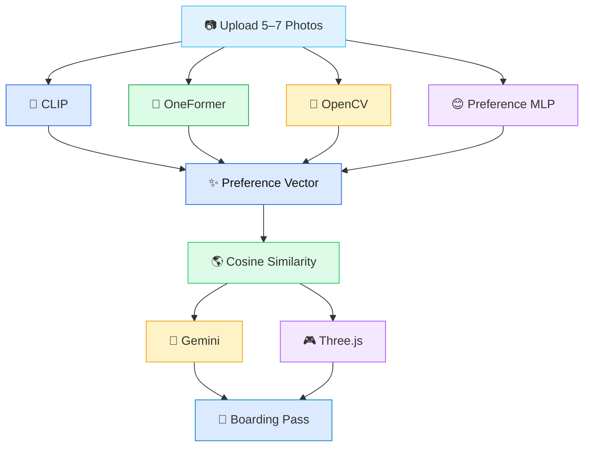

<div align="center">


<br/>

### ✈️ 일상 사진으로 발견하는 나만의 여행 취향

**PhotoTrip은 사용자의 일상 사진 5~7장을 분석하여  
잠재적인 시각 선호를 추론하고, 맞춤 여행지를 추천하는 멀티모달 AI 서비스입니다.**

<br/>


<br/><br/>


<br/><br/>

> ☁️ **No questionnaire. No booking history.**  
> PhotoTrip infers your travel preference only from your everyday photos.

</div>

<br/>

---

<br/>

<div align="center">

## 🛫 Boarding Now

<table>
<tr>
<td align="center" width="180">
<h3>📷</h3>
<b>Upload</b>
<br/>
5–7 daily photos
</td>
<td align="center" width="60">
<h2>→</h2>
</td>
<td align="center" width="180">
<h3>🧠</h3>
<b>Analyze</b>
<br/>
Multimodal AI
</td>
<td align="center" width="60">
<h2>→</h2>
</td>
<td align="center" width="180">
<h3>🌎</h3>
<b>Recommend</b>
<br/>
Personalized trip
</td>
<td align="center" width="60">
<h2>→</h2>
</td>
<td align="center" width="180">
<h3>🎮</h3>
<b>Explore</b>
<br/>
3D scene
</td>
</tr>
</table>

</div>

<br/>

---

<br/>

## ☁️ Why PhotoTrip?

기존 여행 추천 시스템은 사용자의 **명시적 행동 데이터**에 의존합니다.

<br/>

<div align="center">

<table>
<tr>
<td width="45%" align="center">

### 🧳 Traditional Travel Recommendation

<br/>

📝 Survey  
🛒 Booking History  
🖱 Click Log  

<br/>

<b>사용자가 직접 남긴 데이터 기반</b>

</td>
<td width="10%" align="center">

<h2>→</h2>

</td>
<td width="45%" align="center">

### 📸 PhotoTrip

<br/>

📷 Everyday Photos  
🧠 Visual Preference  
🌎 Personalized Destination  

<br/>

<b>무의식적으로 촬영한 사진 기반</b>

</td>
</tr>
</table>

</div>

<br/>

PhotoTrip은 사용자가 일상에서 자연스럽게 촬영한 사진 속에서  
**장소 선호, 공간 구성, 색감, 분위기**를 추론합니다.

핵심은 단순한 장면 분류가 아니라,

> **사용자의 시각적 취향을 하나의 Preference Vector로 표현하는 것**입니다.

<br/>

---

<br/>

## ✨ Key Features

<div align="center">

<table>
<tr>
<td width="50%" valign="top">

<h3>🧠 Multimodal AI Analysis</h3>

CLIP, OneFormer, OpenCV, Preference MLP를 함께 사용하여  
사진 속 장면, 의미 구성, 색감, 분위기를 분석합니다.

<br/>

<b>Scene · Semantic · Visual · Style</b>

</td>
<td width="50%" valign="top">

<h3>☁️ Preference Vector</h3>

사용자의 시각적 취향을  
해석 가능한 44차원 벡터로 표현합니다.

<br/>

<b>44-D Interpretable Representation</b>

</td>
</tr>

<tr>
<td width="50%" valign="top">

<h3>🌎 Personalized Destination</h3>

사용자 Preference Vector와 여행지 프로필을  
코사인 유사도로 비교하여 Top-3 여행지를 추천합니다.

<br/>

<b>Cosine Similarity Matching</b>

</td>
<td width="50%" valign="top">

<h3>🎮 Interactive 3D Scene</h3>

추천 결과를 단순 텍스트가 아니라  
Three.js 기반 인터랙티브 3D 씬으로 시각화합니다.

<br/>

<b>Three.js Travel Visualization</b>

</td>
</tr>
</table>

</div>

<br/>

---

<br/>

## 🎥 Demo

<div align="center">

| 🏙️ City | 🏛️ Culture | 🌿 Nature |
|:--:|:--:|:--:|
| [Video](https://github.com/user-attachments/assets/2e39bb36-876f-4b46-a000-fc9914e87034) | [Video](https://github.com/user-attachments/assets/aa2ad316-7270-4293-bfdf-e43aabe4dada) | [Video](https://github.com/user-attachments/assets/45d3d391-dde3-41f9-a6ee-d80ff77b4c9f) |

| 🍕 Food | 🌊 Beach | 🎆 Festival |
|:--:|:--:|:--:|
| [Video](https://github.com/user-attachments/assets/5ef5fe29-4734-4f77-87b2-511de3855b48) | [Video](https://github.com/user-attachments/assets/a79cddb6-0e5d-4cad-ab43-86cdc3fb5185) | [Video](https://github.com/user-attachments/assets/96f4ace8-f7e2-4662-9a4c-6044df3dc3ec) |

</div>

<br/>

---

<br/>

## 🏆 Key Results

<div align="center">

<table>
<tr>
<td align="center" width="33%">

<h1>93.48%</h1>

<b>CLIP Accuracy</b>

Scene Classification

</td>
<td align="center" width="33%">

<h1>45.6</h1>

<b>OneFormer mIoU</b>

Semantic Segmentation

</td>
<td align="center" width="33%">

<h1>0.9450</h1>

<b>Macro F1</b>

Preference MLP

</td>
</tr>
</table>

</div>

<br/>

<p align="center">
  
</p>

<p align="center">
  
  
</p>

<br/>

---

<br/>

<div align="center">

## 🌊 Core Idea

### Travel preference is not a single category.

It is a combination of

**scene meaning, semantic composition, color mood, and lifestyle preference.**

PhotoTrip integrates these heterogeneous signals into one  
**interpretable Preference Vector**.

</div>

<br/>
---

<br/>

# 🧠 Why A Single Model Is Not Enough?

Travel preference is far more complex than simple scene classification.

A single computer vision model can understand **only one aspect** of an image.

PhotoTrip combines multiple complementary models to capture a user's **latent visual preference**.

<br/>

<div align="center">

| Model | ✅ Strength | ❌ Limitation |
|:------:|:---------------------------|:-----------------------------|
| **🧠 CLIP** | Scene Category Recognition | Cannot understand color, mood, or composition |
| **🌿 OneFormer** | Semantic Scene Composition | Cannot infer user preference |
| **🎨 OpenCV** | Color & Visual Statistics | Cannot understand scene semantics |
| **😊 Preference MLP** | Lifestyle & Mood Prediction | Cannot capture spatial structure |

</div>

<br/>

Instead of relying on a single prediction,

PhotoTrip integrates

- 🌄 Scene Information
- 🌿 Semantic Composition
- 🎨 Visual Characteristics
- 😊 Lifestyle Preference

into a single **Preference Vector**.

---

<br/>

# ☁️ AI Analysis Pipeline



<br/>

---

<br/>

# ☁️ Preference Vector

<div align="center">

### The Core Representation of PhotoTrip

PhotoTrip does not simply classify images.

Instead, it transforms multiple AI outputs into an

# **44-Dimensional Interpretable Preference Vector**

which represents the user's hidden travel preference.

</div>

<br/>

<div align="center">

| Feature Group | Dimension | Description |
|:-------------|:---------:|:------------|
| 🌄 Scene | **6** | beach, city, nature, culture, food, festival |
| 🎨 Visual | **6** | brightness, saturation, contrast, warm tone ... |
| 🌿 Semantic | **5** | water, vegetation, building, sky, food |
| 😊 Style | **6** | cozy, energetic, romantic ... |
| 📍 Place | **6** | preferred travel place |
| 🌤 Mood | **6** | emotional tendency |
| ⭐ Interest | **9** | shopping, anime, sports, café ... |
| **Total** | **44** | Unified Preference Representation |

</div>

<br/>

### Example Preference Vector

```json
{
  "beach": 0.82,
  "nature": 0.11,
  "water": 0.43,
  "vegetation": 0.21,
  "warm_tone": 0.79,
  "saturation": 0.74,
  "energetic": 0.68,
  "cozy": 0.14
}
```

↓

### 🌎 Recommendation

| Rank | Destination |
|:---:|:-------------|
| 🥇 | Bali |
| 🥈 | Phuket |
| 🥉 | Cebu |

↓

### 🤖 AI Explanation

> "You tend to prefer warm colors, vibrant environments, and destinations where beaches and local food coexist."

<br/>

---

<br/>

# 🏗️ System Overview

<div align="center">

| 📷 Input | 🧠 AI Analysis | ✨ Preference Vector | 🌎 Recommendation | 🎮 Visualization |
|:---------:|:-------------:|:--------------------:|:----------------:|:----------------:|
| Daily Photos | CLIP + OneFormer + OpenCV + MLP | 44-D Representation | Cosine Similarity | Three.js + Gemini |

</div>

<br/>

---

<br/>

# 🛠️ Tech Stack

<div align="center">

<table>

<tr>

<td align="center" width="25%">

### 🧠 AI

CLIP

OneFormer

OpenCV

Preference MLP

</td>

<td align="center" width="25%">

### ⚙ Backend

FastAPI

PyTorch

Transformers

</td>

<td align="center" width="25%">

### 🎮 Frontend

Three.js

HTML

CSS

JavaScript

</td>

<td align="center" width="25%">

### ☁️ Services

Gemini API

Google Colab

Kaggle

GPU Training

</td>

</tr>

</table>

</div>

<br/>

---
---

<br/>

# 🚀 Key Contributions

<div align="center">

### What Makes PhotoTrip Different?

PhotoTrip is not about proposing a new vision model.

It is about **integrating heterogeneous AI models**
into a single interpretable travel preference representation.

</div>

<br/>

<div align="center">

| ✨ Contribution | Description |
|:----------------|:------------|
| 🧠 Multimodal Preference Vector | Unified representation from CLIP, OneFormer, OpenCV and Preference MLP |
| 🌎 Personalized Recommendation | Cosine similarity retrieval using handcrafted destination profiles |
| 🎯 Accuracy–Confidence Analysis | Compared CLIP and SigLIP beyond accuracy |
| 🌿 Multi-Dataset OneFormer Training | Unified semantic segmentation across travel domains |
| 🤖 Explainable AI | Gemini generates human-readable travel explanations |

</div>

<br/>

---

<br/>

## 🧠 1. Multimodal Preference Vector

Unlike conventional recommendation systems,

PhotoTrip does not rely on a single model.

Instead,

it combines

- 🧠 Scene Category (CLIP)
- 🌿 Semantic Composition (OneFormer)
- 🎨 Visual Statistics (OpenCV)
- 😊 Lifestyle Preference (Preference MLP)

into one **44-dimensional Preference Vector**.

This representation becomes the user's travel profile
and is directly matched with destination profiles
using cosine similarity.

---

<br/>

## 🎯 2. Accuracy vs Confidence

Most studies compare only **accuracy**.

PhotoTrip additionally compares

> **Inference Confidence**

because confidence directly affects
Preference Vector quality.

<div align="center">

| Model | Accuracy | Confidence |
|:------:|:--------:|:----------:|
| SigLIP | **93.56%** | **33–37%** |
| CLIP Fine-tuned ✅ | **93.48%** | **79–87%** |

</div>

Although both models achieve similar accuracy,

CLIP provides significantly higher confidence,
resulting in more stable preference estimation.

<br/>

<p align="center">

</p>

---

<br/>

## 🌿 3. OneFormer Multi-Dataset Training

Instead of training multiple segmentation models,

PhotoTrip trains **a single OneFormer**
using three different datasets.

<div align="center">

| Dataset | Domain |
|:--------:|:--------|
| ADE20K | Indoor / Outdoor Scenes |
| FoodSeg103 | Food Images |
| Cityscapes | Urban Environment |

</div>

This unified training strategy improved

**Travel-class mIoU**

from

> **37.1 → 45.6 (+8.5%p)**

<br/>

<p align="center">

</p>

---

<br/>

## 😊 4. Preference MLP

A dedicated multilabel classifier predicts

- Mood
- Style
- Lifestyle

from CLIP image embeddings.

<div align="center">

| Input | Architecture | Output |
|:------:|:------------:|:------:|
| CLIP Embedding (768-dim) | 768 → 512 → 256 → 128 → 6 | Multilabel Preference |

</div>

Training Strategy

- BCE Loss
- Class Weight
- Rare Class Sampler
- Pseudo Labeling

Final Performance

<div align="center">

# ⭐ Macro F1 = **0.9450**

</div>

<p align="center">

</p>

---

<br/>

# 📊 Experimental Results

<div align="center">

## Overall Performance

</div>

<div align="center">

| Module | Performance |
|:------:|:------------|
| 🧠 CLIP Fine-tuned | **93.48% Accuracy** |
| 🌿 OneFormer | **45.6 mIoU** |
| 😊 Preference MLP | **Macro F1 0.9450** |
| 🎨 OpenCV | 6 Visual Metrics |
| 🌎 Recommendation | Top-3 Personalized Destinations |
| 🎮 Three.js | Interactive Visualization |

</div>

<br/>

---

<br/>

## 📈 Training Results

<p align="center">


</p>

<br/>

<p align="center">


</p>

<br/>

<p align="center">


</p>

<br/>

---

<br/>

---
---

<br/>

# 🌐 System Implementation

<div align="center">

### End-to-End AI Travel Recommendation Service

</div>

<br/>

<div align="center">

| Layer | Technology |
|:------:|:-----------|
| ⚙ Backend | FastAPI · PyTorch |
| 🧠 AI Models | CLIP · OneFormer · OpenCV · Preference MLP |
| 🤖 LLM | Google Gemini API |
| 🎮 Frontend | Three.js · HTML · CSS · JavaScript |
| ✈ Visualization | CV Dashboard · Boarding Pass · Interactive 3D Scene |

</div>

<br/>

PhotoTrip connects multiple AI models into a single end-to-end pipeline.

Instead of returning only classification results,

the system visualizes the recommendation through

- 📊 CV Dashboard
- 🤖 Gemini Explanation
- 🎫 Boarding Pass
- 🎮 Interactive Three.js Scene

to provide a complete travel recommendation experience.

---

<br/>

# ⚠️ Limitations

Although PhotoTrip demonstrates strong performance,

several limitations remain.

---

### 1️⃣ Coarse-Grained Travel Categories

The current taxonomy consists of

- Beach
- Nature
- City
- Culture
- Festival
- Food

Although practical,

real travel preference is much more diverse.

For example,

users who prefer beaches may actually prefer

- Luxury Resorts
- Natural Landscapes
- Water Activities

which cannot yet be distinguished.

---

### 2️⃣ Multi-Domain Evaluation

OneFormer was trained using

- ADE20K
- FoodSeg103
- Cityscapes

However,

there is currently no benchmark specifically designed for

travel preference analysis across multiple domains.

As a result,

evaluation is performed independently on each dataset.

---

### 3️⃣ Pseudo Label Noise

Preference MLP training data was generated

using automatic pseudo labeling.

Although confidence filtering was applied,

label noise and dataset bias may still remain.

Future versions may combine

human annotated data

with pseudo labeled data.

---

### 4️⃣ Handcrafted Preference Vector

The current Preference Vector

is manually designed using

- Scene
- Semantic
- Visual
- Style

features.

Although interpretable,

it may not fully represent

the user's latent preference.

A learnable preference embedding

would allow more generalized representation.

---

### 5️⃣ External API Dependency

Natural language explanation

depends on

Google Gemini API.

Future versions may adopt

lightweight local language models

to reduce external dependency.

---

### 6️⃣ Subjectivity of Style Labels

Lifestyle

Mood

Style

are inherently subjective.

The same image

may be interpreted differently

by different users.

Future work includes

user feedback based personalization.

---

<br/>

# 🚀 Future Work

<div align="center">

### Future Directions

</div>

<br/>

<table>

<tr>

<td width="50%" valign="top">

### 🧠 Learnable Preference Embedding

Replace handcrafted features

with

end-to-end learned preference embeddings.

</td>

<td width="50%" valign="top">

### 🔄 Personalized Feedback Loop

Continuously improve

Preference Vector

using user feedback.

</td>

</tr>

<tr>

<td width="50%" valign="top">

### 🌎 Large-scale Destination Retrieval

Expand from

predefined destinations

to

large-scale retrieval

using destination image databases.

</td>

<td width="50%" valign="top">

### 🏖 Fine-grained Travel Categories

Expand

Beach

↓

Luxury Resort

Nature

↓

National Park

City

↓

Night View

Food

↓

Local Restaurant

and other detailed travel themes.

</td>

</tr>

</table>

<br/>

<div align="center">

## ✨ Vision

PhotoTrip aims to become

an explainable AI travel recommendation system

that understands

not only **where people travel,**

but also

**why they are visually attracted to those places.**

</div>

<br/>

---
---

<br/>

# 🚀 Quick Start

<div align="center">

### Get PhotoTrip Running in Minutes

</div>

<br/>

## ① Clone Repository

```bash
git clone https://github.com/your-username/PhotoTrip.git
cd PhotoTrip
```

---

## ② Create Virtual Environment

```bash
python -m venv venv

# Windows
venv\Scripts\activate

# Linux / macOS
source venv/bin/activate
```

---

## ③ Install Dependencies

```bash
pip install -r requirements.txt
```

---

## ④ Configure Environment

Create a `.env` file in the project root.

```env
GOOGLE_API_KEY=your_gemini_api_key
```

---

## ⑤ Prepare Model Weights

Place the trained models inside

```text
models/

├── best_clip.pth
├── best_siglip.pth
├── mlp_mood_best.pth
├── mlp_place_best.pth
├── mlp_style_best.pth
└── oneformer_top/
    ├── config.json
    ├── model.safetensors
    ├── processor_config.json
    ├── tokenizer.json
    └── tokenizer_config.json
```

---

## ⑥ Run Server

```bash
python -m uvicorn backend.main:app --reload --port 8000
```

Open

```text
http://localhost:8000
```

---

# ✈️ Usage

<div align="center">

### Your Travel Journey

</div>

<br/>

```text
📷 Upload 5–7 Photos
        │
        ▼
🧠 AI Analysis
        │
        ▼
✨ Preference Vector
        │
        ▼
🌎 Personalized Recommendation
        │
        ▼
🤖 Gemini Explanation
        │
        ▼
🎮 Three.js Scene
        │
        ▼
🎫 Boarding Pass
```

---

# 📂 Project Structure

```text
PhotoTrip/

├── backend/
├── frontend/
├── models/
├── results/
├── classification/
├── segmentation/
├── recommendation/
├── utils/
├── requirements.txt
└── README.md
```

---

# 📖 References

## Vision-Language Models

- Radford et al. (2021). **CLIP: Learning Transferable Visual Models From Natural Language Supervision**
- Zhai et al. (2023). **SigLIP: Sigmoid Loss for Language Image Pre-Training**

---

## Semantic Segmentation

- Jain et al. (2023). **OneFormer**
- Cheng et al. (2022). **Mask2Former**

---

## Datasets

- ADE20K
- FoodSeg103
- Cityscapes

---

## APIs & Frameworks

- Google Gemini API
- HuggingFace Transformers
- FastAPI
- PyTorch
- Three.js

---

# 🙏 Acknowledgements

This project was developed as a Computer Vision course project.

Special thanks to

- Google Colab
- Kaggle GPU
- Pixabay API
- HuggingFace
- Google Gemini API

for supporting model training and deployment.

---

<br/>

<div align="center">

# ☁️ Thank You

### 📸 PhotoTrip

**Discover Your Travel Style From Everyday Photos**

<br/>


Made with ❤️ using

PyTorch • FastAPI • Three.js • Gemini

</div>
